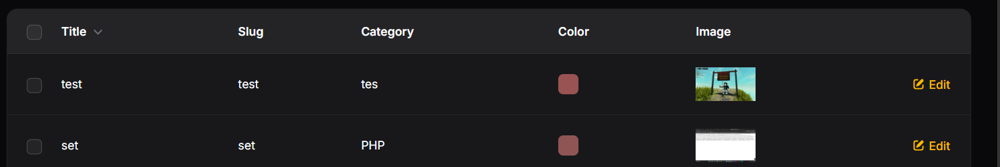
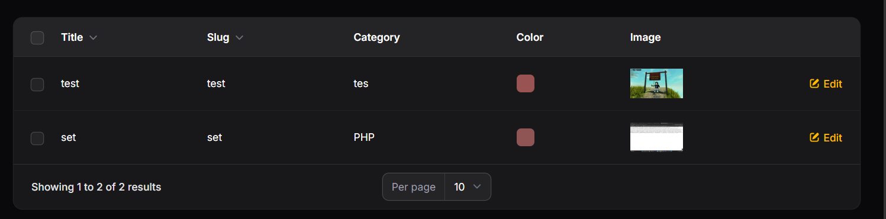
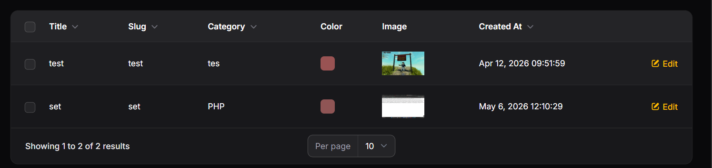

# LAPORAN PRAKTIKUM

## Implementasi Sorting (Ascending & Descending) pada Table Filament

### Identitas

* Mata Kuliah: Pemrograman Web Lanjut
* Topik: Implementasi Sorting (Ascending & Descending) pada Table Filament
* Nama: Muhammad Fatahillah Athabrani
* Kelas: TI2F
* NIM: 244107020121

---

## Tujuan

1. Menambahkan fitur sorting kolom pada tabel Filament.
2. Menggunakan method `sortable()`.
3. Menerapkan sorting pada kolom relasi.
4. Menerapkan sorting pada kolom tanggal.
5. Mengatur default sorting tabel.

---

## Langkah-langkah Praktikum

### 1. Konsep Sorting di Filament
Pada Laravel biasa, melakukan sorting data membutuhkan penulisan query manual dan kondisi `orderBy` dengan parameter request. Namun, dengan menggunakan framework Filament, implementasi fitur sorting dapat dilakukan dengan sangat sederhana hanya dengan chaining method `->sortable()` pada kolom tabel yang diinginkan.

### 2. Implementasi Sorting pada Kolom Teks Dasar
Untuk memberikan kapabilitas pengurutan (A-Z atau Z-A) pada kolom teks konvensional, kita perlu memodifikasi file `PostsTable.php`. Method `->sortable()` ditambahkan pada inisialisasi `TextColumn` milik properti `title` dan `slug`. Dengan begitu, pengguna bisa mengklik header pada antarmuka tabel untuk mengubah arah urutan data.

### 3. Implementasi Sorting pada Kolom Relasi (Category)
Filament memiliki kemampuan ORM yang cerdas sehingga mampu secara otomatis menangani join relasi database di balik layar. Kita cukup memanggil kolom berelasi menggunakan notasi dot (titik), contohnya `category.name`, lalu merangkainya dengan method `->sortable()`. Hal ini sangat efisien dibandingkan menyusun query join manual.

### 4. Implementasi Sorting pada Kolom Tanggal
Data berupa timestamp seperti waktu pembuatan data dapat direpresentasikan menggunakan `TextColumn::make('created_at')`. Untuk memformat tampilannya agar mudah dibaca, kita menyisipkan fungsi `->dateTime()` yang juga mendukung method `->sortable()` agar data bisa diurutkan dari entri terbaru hingga terlama, maupun sebaliknya.

### 5. Mengatur Default Sorting Tabel
Agar pengguna tidak perlu mengklik header tabel setiap kali memuat ulang halaman, kita menetapkan state pengurutan awal menggunakan fungsi `->defaultSort('column', 'direction')` pada skema configure tabel. Sebagai contoh, mengatur data terbaru agar selalu tampil paling atas secara default menggunakan `->defaultSort('created_at', 'desc')`.

---

## Implementasi Kode (`PostsTable.php`)

```php
use Filament\Tables\Columns\TextColumn;
use Filament\Tables\Columns\ColorColumn;
use Filament\Tables\Columns\ImageColumn;
use Filament\Tables\Table;

public static function configure(Table $table): Table
{
    return $table
        // Menerapkan default sorting berdasarkan Created At terbaru (descending)
        ->defaultSort('created_at', 'desc') 
        ->columns([
            TextColumn::make('title')
                ->sortable(), // Mengaktifkan sortable pada Title
            
            TextColumn::make('slug')
                ->sortable(), // Mengaktifkan sortable pada Slug
            
            TextColumn::make('category.name')
                ->sortable(), // Mengaktifkan sortable pada relasi Category
            
            ColorColumn::make('color'),
            
            ImageColumn::make('image')
                ->disk('public'),
            
            TextColumn::make('created_at')
                ->label('Created At') // Mengubah nama kolom
                ->dateTime() // Menyesuaikan format tanggal
                ->sortable(), // Mengaktifkan sortable pada Created At
        ])
        ->filters([
            //
        ])
        ->actions([
            //
        ]);
}
```

---

## Hasil (Latihan Praktikum)

1. **Sorting Title Ascending (A - Z)**


2. **Sorting Title Descending (Z - A)**


3. **Default Sorting Date Descending (Terbaru ke Terlama)**


---

## Analisis & Diskusi

1. **Mengapa sorting penting pada admin panel?**
   Sorting adalah fitur fundamental di dalam sistem admin panel karena berkaitan langsung dengan efisiensi operasional. Saat berhadapan dengan basis data berskala besar (ribuan hingga jutaan entri), fitur sorting memungkinkan admin untuk menemukan, mengelompokkan, dan menganalisis pola informasi (seperti produk termurah, user pendaftar terbaru, dsb) secara instan tanpa perlu memilah data satu per satu secara manual.

2. **Apa perbedaan sortable biasa dengan defaultSort()?**
   - **sortable()** adalah fungsi perantara (level-kolom) yang menambahkan kapabilitas dan tombol antarmuka (icon panah di header kolom tabel) agar pengguna dapat menyortir baris data secara dinamis (aktif/manual).
   - **defaultSort()** adalah pengaturan konfigurasi (level-tabel) yang menetapkan perilaku bawaan (statis/otomatis) mengenai bagaimana urutan data harus ditampilkan ketika halaman Resource tabel dimuat pertama kali sebelum ada interaksi sorting dari pengguna.

3. **Mengapa relasi tetap bisa di-sort?**
   Filament dibangun di atas ecosystem Laravel Eloquent. Ketika kita memanggil method `->sortable()` pada kolom dengan notasi titik (`namaTabelRelasi.namaKolom`), secara cerdas Filament akan menyuntikkan statement `JOIN` ke dalam pembentukan SQL Query builder secara implisit (Otomatis). Hal ini men-sinkronisasikan indeks foreign key tabel utama dengan primary key tabel terkait agar pengurutan bisa terjadi tanpa konfigurasi join manual.

4. **Kapan kita menggunakan desc sebagai default?**
   Penggunaan urutan menurun (descending) sangat krusial dan direkomendasikan pada pengarsipan tipe data log, antrean (queue), transaksi, atau entitas konten dinamis (seperti artikel blog). Jika diimplementasikan pada kolom tanggal (seperti `created_at` atau `updated_at`), algoritma `desc` akan mengekspos data yang paling aktual/baru saja dimasukkan ke urutan paling atas baris nomor satu, yang merupakan fokus prioritas utama pengguna admin panel.

---

## Kesimpulan

Pada pertemuan praktik ini, saya sukses mengeksplorasi utilitas manajemen data tabular pada framework Filament dengan menerapkan fitur sorting. Penambahan kontrol method seperti `->sortable()` dan `->defaultSort()` telah mengotomatisasi kerumitan manuver query order pada Laravel. Selain itu, Filament terbukti andal dalam menangani skenario relasi antartabel (Database Joins) dan manipulasi komponen Date Time. Integrasi kapabilitas pengurutan cerdas ini merupakan syarat mutlak demi mencapai standar pengalaman pengguna (UX) secara prima dalam manajemen database skala besar.
