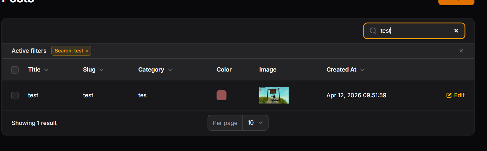
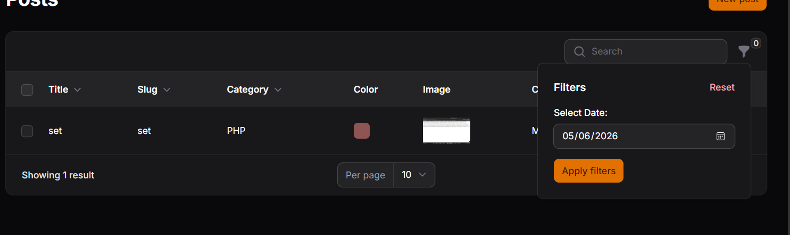
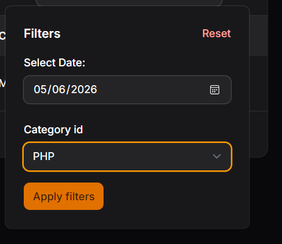
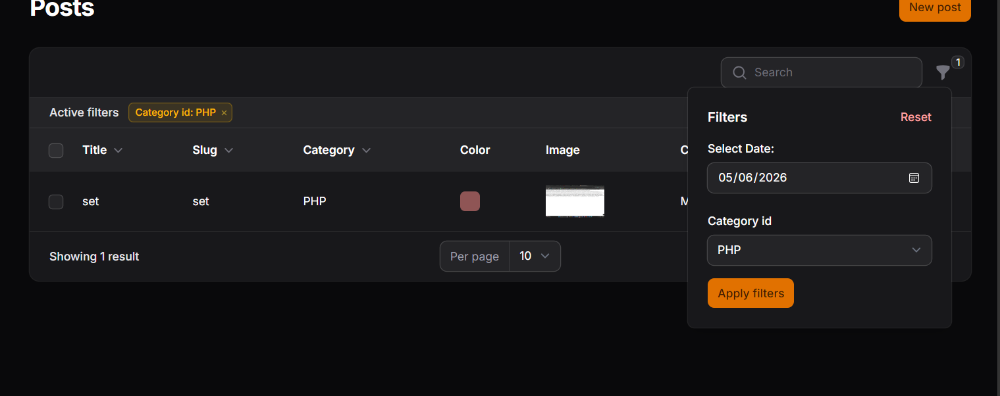

# LAPORAN PRAKTIKUM

## Implementasi Search & Filter pada Table Filament

### Identitas

* Mata Kuliah: Pemrograman Web Lanjut
* Topik: Implementasi Search & Filter pada Table Filament
* Nama: Muhammad Fatahillah Athabrani
* Kelas: TI2F
* NIM: 244107020121

---

## Tujuan

1. Menambahkan fitur Search (Pencarian) pada tabel.
2. Menggunakan method `searchable()`.
3. Membuat filter berdasarkan tanggal (Date Filter).
4. Membuat filter berdasarkan relasi (Select Filter).
5. Menambahkan query custom pada filter.
6. Menggabungkan fitur Search dan Filter secara bersamaan.

---

## Langkah-langkah Praktikum

### 1. Konsep Search dan Penerapannya

Pada sistem dengan volume data besar, pencarian tekstual sangat dibutuhkan. Framework Filament menyederhanakan fitur ini dengan menyediakan method `searchable()`. Method ini ditambahkan langsung pada konfigurasi kolom teks yang diinginkan, sehingga sistem secara otomatis men-generate search bar di atas tabel yang dapat melakukan pencarian secara real-time.

### 2. Implementasi Pencarian Multi-Kolom

Pencarian diterapkan pada tiga kolom utama:
* **Title**: Diimplementasikan dengan menambahkan `->searchable()` pada `TextColumn::make('title')`.
* **Slug**: Diimplementasikan dengan menambahkan `->searchable()` pada `TextColumn::make('slug')`.
* **Category**: Pencarian juga dapat menembus relasi database dengan menambahkan method tersebut pada `TextColumn::make('category.name')`.

### 3. Implementasi Filter Tanggal (Date Filter)

Karena pencarian tekstual (Search) tidak ideal untuk data berformat tanggal, kita menggunakan fitur Filter.
* Komponen `Filter::make('created_at')` diinisialisasi di dalam array method `->filters()`.
* Untuk antarmukanya, skema form diisi dengan antarmuka kalender menggunakan komponen `DatePicker::make('created_at')`.
* Agar logika filter benar-benar berjalan dalam mengeksekusi data pada tingkat database, diinjeksikan sebuah Custom Query menggunakan closure function yang memanggil spesifikasi Eloquent `->whereDate('created_at', $date)`.

### 4. Implementasi Filter Relasi (Select Filter)

Untuk mengelompokkan data berdasarkan kategori secara spesifik, digunakan fitur `SelectFilter`.
* Diinisialisasi menggunakan `SelectFilter::make('category_id')`.
* Opsi dropdown ditarik secara otomatis dari model tabel yang berelasi menggunakan method `->relationship('category', 'name')`, di mana `'category'` adalah nama fungsi relasi (metode `belongsTo`) di model `Post`, dan `'name'` adalah kolom yang direpresentasikan.

---

### Implementasi Kode (PostsTable.php)

```php
use Filament\Tables\Columns\TextColumn;
use Filament\Tables\Columns\ColorColumn;
use Filament\Tables\Columns\ImageColumn;
use Filament\Tables\Filters\Filter;
use Filament\Tables\Filters\SelectFilter;
use Filament\Forms\Components\DatePicker;
use Filament\Tables\Table;

public static function configure(Table $table): Table
{
    return $table
        ->columns([
            TextColumn::make('title')
                ->sortable()
                ->searchable(), // Mengaktifkan pencarian teks pada Title
            
            TextColumn::make('slug')
                ->sortable()
                ->searchable(), // Mengaktifkan pencarian teks pada Slug
            
            TextColumn::make('category.name')
                ->sortable()
                ->searchable(), // Mengaktifkan pencarian teks menembus relasi Kategori
            
            ColorColumn::make('color'),
            
            ImageColumn::make('image')
                ->disk('public'),
            
            TextColumn::make('created_at')
                ->label('Created At')
                ->dateTime()
                ->sortable(),
        ])
        ->defaultSort('created_at', 'desc') // Best practice: Data terbaru di atas
        ->filters([
            // Filter berdasarkan rentang hari/tanggal spesifik
            Filter::make('created_at')
                ->label('Creation Date')
                ->schema([
                    DatePicker::make('created_at')
                        ->label('Select Date:'),
                ])
                ->query(function ($query, $data) {
                    return $query->when(
                        $data['created_at'],
                        fn ($query, $date) => $query->whereDate('created_at', $date)
                    );
                }),
            
            // Filter Select Dropdown berdasarkan relasi tabel
            SelectFilter::make('category_id')
                ->label('Category')
                ->relationship('category', 'name')
                ->preload(),
        ]);
}
```

---

## Hasil (Latihan Praktikum)


* Implementasi Search pada Title, Slug, & Category


* Implementasi Filter Tanggal (Date Picker)


* Implementasi Filter Kategori (Select Dropdown Relasi)


* Kombinasi Pengujian Search + Filter Kategori


---

## Analisis & Diskusi

1. **Mengapa search tidak cocok untuk filter tanggal?**
   Search merupakan fitur pencarian yang mencocokkan string (teks) secara harfiah [literal]. Kolom tanggal biasanya tersimpan sebagai tipe data Timestamp atau DateTime di database, dan format tampilannya pun sering kali diubah (dimutasi) di frontend. Memaksa search bar mencari inputan tanggal sangat rentan mengalami gagal kecocokan query karakter (format yang berbeda) dan tidak bisa mengeksekusi pencarian secara kontekstual. Oleh karena itu, kita membutuhkan fitur Filter yang secara khusus menangani kondisi logika tanggal (kondisi spesifik).

2. **Apa fungsi `relationship()` pada SelectFilter?**
   Fungsi `relationship()` adalah pemicu cerdas (ORM helper) di Filament yang meniadakan kebutuhan untuk melakukan query manual pembuatan opsi daftar pilihan. Parameter pertamanya memanggil method relasi Eloquent (`category`), sedangkan parameter keduanya (`name`) mendikte atribut mana dari tabel relasi tersebut yang ingin dirender/ditampilkan sebagai label teks (dropdown option) di antarmuka antarmuka.

3. **Mengapa kita perlu `whereDate()` pada query filter?**
   Data di kolom `created_at` memiliki rincian waktu hingga satuan detik (Y-m-d H:i:s), sementara komponen DatePicker umumnya melempar spesifikasi pada tataran hari dan tanggal saja (Y-m-d). Jika kita menggunakan klausa `where()` standar, sistem akan gagal menemukan persamaan yang absolut (exact match). Oleh karena itu, method spesifik `->whereDate()` disematkan untuk memotong rincian Jam/Menit/Detik pada data referensi database, agar sistem hanya melakukan penyesuaian porsi tanggalnya (Date) dengan input dari kalender pengguna.

4. **Apa perbedaan `searchable()` dan `filters()`?**
   * **`searchable()`**: Dirancang untuk kueri berbasis teks (seperti judul atau slug). Fitur ini beroperasi secara real-time begitu kita mengetik kata kunci pada sebuah baris input (Global Search Box) tanpa memerlukan tombol "Apply".
   * **`filters()`**: Dirancang untuk kondisi penyortiran logika logis yang spesifik seperti waktu kejadian (timestamp) atau relasional objek. Antarmuka ini bergantung pada bentuk interaksi form input yang khusus (seperti komponen Date Picker atau Dropdown Select) dan sering kali menuntut event listener interaksi seperti menekan tombol eksekusi (Apply Filters) agar penyaringan aktif pada panel data.

---

## Kesimpulan

Pada sesi praktik operasional ke-11 ini, mahasiswa telah sukses mempelajari tata laksana implementasi penyaringan entitas data lanjut pada Filament. Integrasi method `->searchable()` terbukti mampu memberikan hasil pencarian tekstual secara cepat dan intuitif. Bersamaan dengan itu, pembentukan konfigurasi Filter berbasis DatePicker dan SelectFilter terbukti jauh lebih kapabel saat berhadapan dengan data tipe kondisional maupun relasional antar tabel. Kemampuan untuk menyatukan pencarian global multi-kolom beserta parameter saring ganda yang dapat di-custom melalui injeksi Eloquent Query (penggabungan Search dan Filter) adalah skill vital yang akan menjamin performa skalabilitas data tetap mulus (seamless) dalam skenario arsitektur basis data yang massive.