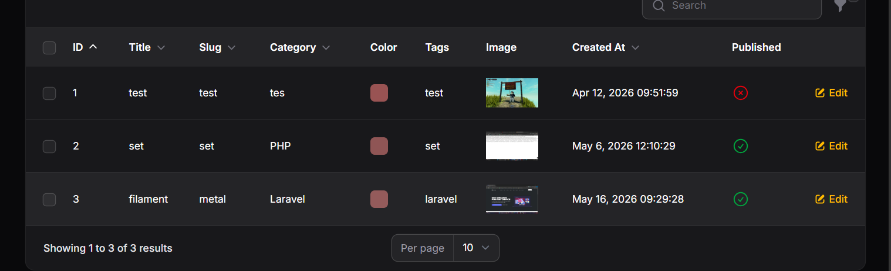
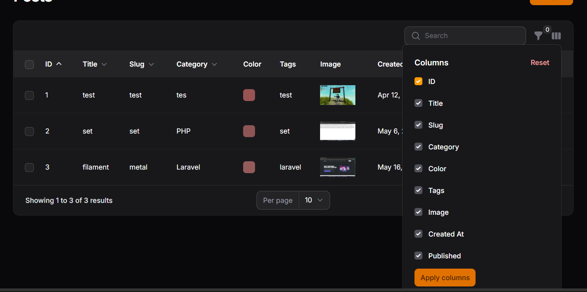
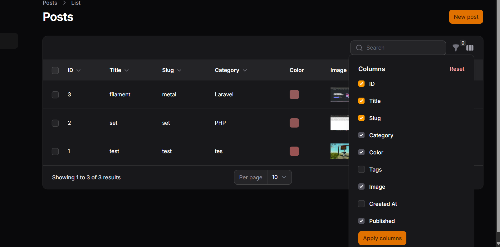

# LAPORAN PRAKTIKUM
## Implementasi Toggle Column pada Table Filament

### Identitas
* **Mata Kuliah:** Pemrograman Web Lanjut
* **Topik:** Implementasi Toggle Column pada Table Filament
* **Nama:** Muhammad Fatahillah Athabrani
* **Kelas:** TI2F
* **NIM:** 244107020121

---

## Tujuan
1. Menambahkan kolom baru pada tabel Filament.
2. Menggunakan `IconColumn` untuk visualisasi tipe data boolean.
3. Mengaktifkan fitur `toggleable()` untuk mengatur visibilitas kolom secara dinamis.
4. Mengatur kolom agar tersembunyi secara bawaan (default) menggunakan `isToggledHiddenByDefault`.
5. Memahami mekanisme penyimpanan preferensi kolom melalui session browser.

---

## Langkah-langkah Praktikum

### 1. Konsep Manajemen Visibilitas Kolom
Seiring bertambahnya jumlah data dan atribut dalam sebuah tabel (seperti ID, Image, Category, Tags, dll), antarmuka admin bisa menjadi sangat penuh dan berantakan. Fitur **Toggle Column** di Filament hadir untuk memberikan kontrol penuh kepada admin dalam memilih kolom mana yang ingin ditampilkan atau disembunyikan tanpa harus mengubah kode program.

### 2. Penambahan Kolom Baru & Representasi Boolean
Dalam praktikum ini, saya menambahkan beberapa kolom baru ke dalam `PostsTable.php`:
* **ID & Tags**: Menggunakan `TextColumn` standar.
* **Published**: Menggunakan `IconColumn::make('published')->boolean()`. Karena status publikasi biasanya bernilai true/false, penggunaan ikon jauh lebih informatif dan rapi dibandingkan sekadar teks "1" atau "0".

### 3. Mengaktifkan Fitur Toggleable
Agar sebuah kolom bisa "dihidup-matikan" oleh user, saya menambahkan method `->toggleable()`. Secara otomatis, Filament akan memunculkan menu pengaturan kolom (ikon kolom di kanan atas tabel). Di sana, user bisa mencentang kolom apa saja yang ingin dilihat, lalu klik **Apply** untuk melihat perubahannya secara instan.

### 4. Menyembunyikan Kolom Secara Default
Beberapa data seperti `id` atau `tags` mungkin tidak perlu dilihat setiap saat karena sifatnya yang hanya sebagai informasi pendukung. Untuk menyembunyikannya saat halaman pertama kali dibuka, saya menggunakan parameter `isToggledHiddenByDefault: true` di dalam method `toggleable()`. Data ini tidak hilang, hanya saja user perlu mengaktifkannya secara manual jika ingin melihatnya.

### 5. Retensi Preferensi via Session
Satu hal yang menarik adalah sistem Filament secara otomatis menyimpan pilihan toggle kita ke dalam session browser. Jadi, kalau saya me-refresh halaman atau pindah ke menu lain lalu kembali lagi, susunan kolom yang sudah saya atur tidak akan berubah kembali ke awal. Ini sangat membantu menjaga alur kerja tetap konsisten.

---

## Implementasi Kode (PostsTable.php)

```php
use Filament\Tables\Columns\TextColumn;
use Filament\Tables\Columns\ColorColumn;
use Filament\Tables\Columns\ImageColumn;
use Filament\Tables\Columns\IconColumn;
use Filament\Tables\Table;

public static function configure(Table $table): Table
{
    return $table
        ->columns([
            TextColumn::make('id')
                ->label('ID')
                ->sortable()
                // Menyembunyikan kolom ID secara default
                ->toggleable(isToggledHiddenByDefault: true), 
            
            TextColumn::make('title')
                ->label('Title')
                ->sortable()
                ->searchable()
                ->toggleable(), // Mengaktifkan fitur toggle
            
            TextColumn::make('slug')
                ->label('Slug')
                ->sortable()
                ->searchable()
                ->toggleable(), 
            
            TextColumn::make('category.name')
                ->label('Category')
                ->sortable()
                ->searchable()
                ->toggleable(), 
            
            ColorColumn::make('color')
                ->toggleable(),
            
            ImageColumn::make('image')
                ->disk('public')
                ->toggleable(),
            
            TextColumn::make('created_at')
                ->label('Created At')
                ->dateTime()
                ->sortable()
                ->toggleable(),
                
            TextColumn::make('tags')
                ->label('Tags')
                ->toggleable(isToggledHiddenByDefault: true),
                
            IconColumn::make('published')
                ->boolean()
                ->label('Published')
                ->toggleable(),
        ])
        ->defaultSort('created_at', 'desc')
        ->filters([
        ]);
}
```

---

## Hasil (Latihan Praktikum)

* **Tampilan Sebelum Di-toggle (Hanya Menampilkan Kolom Utama)**


* **Menu Toggle Kolom (Mengelola Visibilitas Kolom)**


* **Tampilan Setelah Modifikasi (Beberapa Kolom Dihilangkan, Beberapa Dimunculkan)**


---

## Analisis & Diskusi

1.  **Mengapa toggle column penting pada admin panel?**
    Menurut saya, toggle column sangat krusial untuk mengatasi masalah layar yang sempit (viewport limitation). Bayangkan jika sebuah tabel punya 20 kolom, pasti user harus melakukan horizontal scroll yang sangat melelahkan. Dengan toggle, admin bisa menyesuaikan tampilan dengan data yang paling mereka butuhkan saat itu saja (personalization UX).

2.  **Apa perbedaan `toggleable()` biasa dengan `isToggledHiddenByDefault`?**
    *   `toggleable()`: Memberikan akses menu agar kolom bisa disembunyikan, tapi kolomnya tetap muncul saat pertama kali buka halaman.
    *   `isToggledHiddenByDefault`: Kolom tersebut sudah "tersembunyi" dari awal, dan user harus manual mencentangnya di menu toggle kalau mau memunculkannya.

3.  **Mengapa preferensi kolom tetap tersimpan?**
    Ini karena Filament memanfaatkan Session browser. Fitur ini adalah standar "Quality of Life" yang bagus, karena admin tidak perlu repot-repot mengatur ulang tampilan tabel setiap kali selesai melakukan refresh atau pindah halaman.

4.  **Kapan sebaiknya kolom disembunyikan secara default?**
    Praktik terbaiknya adalah untuk data-data "sekunder" yang jarang dilihat, contohnya:
    *   Primary Key (ID/UUID) yang biasanya hanya dipakai buat referensi sistem.
    *   Timestamp tambahan seperti `updated_at` atau `deleted_at`.
    *   Kolom yang isinya sangat panjang (seperti Tags atau Deskripsi) yang bisa merusak kerapian tabel.

---

## Kesimpulan

Pada praktikum ke-12 ini, saya berhasil meningkatkan kerapian dan kenyamanan antarmuka tabel menggunakan fitur **Toggle Column**. Penggunaan `IconColumn` juga membuat data boolean jadi jauh lebih mudah dibaca secara visual. Dengan kombinasi `toggleable()` dan `isToggledHiddenByDefault`, saya bisa membuat dashboard yang sangat fleksibel dan adaptif, di mana admin punya kontrol penuh atas apa yang ingin mereka lihat di layar tanpa mengorbankan kebersihan desain (Clean UI).
