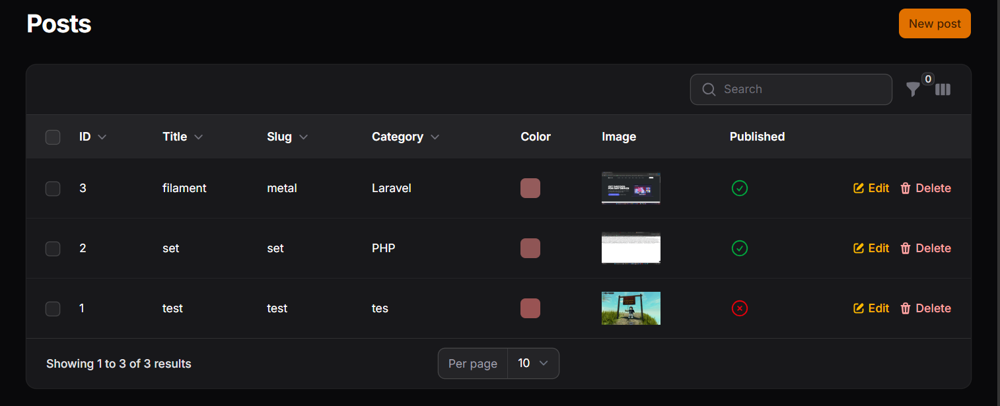
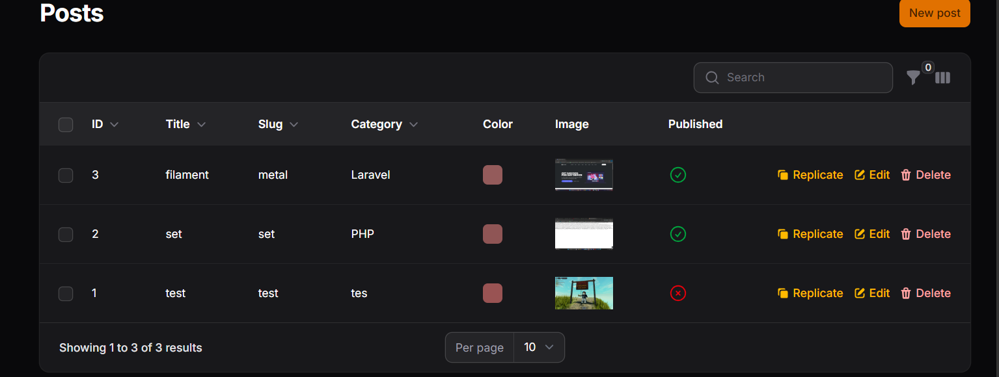
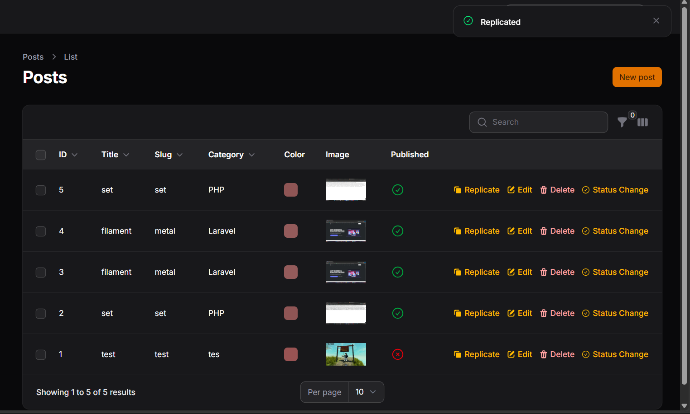

# LAPORAN PRAKTIKUM
## Implementasi Table Actions pada Filament

### Identitas
* **Mata Kuliah:** Pemrograman Web Lanjut
* **Topik:** Implementasi Table Actions pada Filament
* **Nama:** Muhammad Fatahillah Athabrani
* **Kelas:** TI2F
* **NIM:** 244107020121

---

## Tujuan
1. Memahami konsep dan implementasi Record Actions pada tabel Filament.
2. Menambahkan aksi penghapusan data langsung dari baris tabel menggunakan `DeleteAction`.
3. Mengimplementasikan fitur penggandaan data menggunakan `ReplicateAction`.
4. Merancang dan membuat Custom Action untuk fungsionalitas khusus (Quick Update Status).
5. Mengintegrasikan komponen form (Checkbox) dan dialog konfirmasi ke dalam Custom Action.

---

## Langkah-langkah Praktikum

### 1. Latar Belakang & Konsep Table Actions
Secara default, Filament biasanya hanya menampilkan tombol Edit pada baris tabel, sementara tombol Delete diletakkan di dalam halaman edit. Untuk mempercepat kerja admin, saya mengoptimalkan antarmuka dengan menambahkan aksi-aksi penting langsung ke baris tabel (Record Actions). Dengan begitu, operasi harian seperti menghapus atau menggandakan data bisa dilakukan jauh lebih cepat.

### 2. Menambahkan Delete Action
Agar data bisa dihapus tanpa perlu membuka halaman edit terlebih dahulu, saya menambahkan `DeleteAction::make()` ke dalam method `recordActions([])`. Fitur ini sudah otomatis dilengkapi dengan dialog konfirmasi, sehingga meminimalisir risiko penghapusan data yang tidak sengaja.

### 3. Menambahkan Replicate Action
Dalam pengelolaan konten, sering kali saya perlu membuat data yang isinya mirip dengan data yang sudah ada. Dibanding mengetik ulang, saya menggunakan `ReplicateAction::make()`. Fitur ini secara otomatis membuat salinan data baru di database dengan atribut yang sama persis hanya dengan satu klik.

### 4. Mendesain Custom Action (Modifikasi Status Publish)
Terkadang, aksi bawaan tidak cukup. Contohnya, saya ingin mengubah status "Published" secara cepat tanpa masuk ke form edit. Di sini saya membuat **Custom Action**:
*   Menggunakan `Action::make('status')` dengan label "Status Change".
*   Menambahkan `->schema([])` yang berisi `Checkbox::make('published')` agar muncul pop-up mini saat tombol diklik.
*   Menambahkan `->requiresConfirmation()` untuk memberikan lapisan keamanan tambahan.
*   Menulis logika update database menggunakan closure function `->action(function ($record, $data) { ... })` yang memicu Eloquent `update`.

---

## Implementasi Kode (PostsTable.php)

```php
use Filament\Actions\EditAction;
use Filament\Actions\DeleteAction;
use Filament\Actions\ReplicateAction;
use Filament\Actions\Action;
use Filament\Forms\Components\Checkbox;
use Filament\Tables\Table;

public static function configure(Table $table): Table
{
    return $table
        ->columns([
            // (Kolom-kolom tabel seperti ID, Title, dll)
        ])
        ->defaultSort('created_at', 'desc')
        ->filters([
            // (Filter yang sudah dibuat sebelumnya)
        ])
        ->recordActions([
            // Aksi untuk menggandakan data
            ReplicateAction::make(),
            
            // Aksi untuk mengedit data
            EditAction::make(),
            
            // Aksi untuk menghapus data langsung
            DeleteAction::make(),
            
            // Custom Action untuk update status publish secara cepat
            Action::make('status')
                ->label('Status Change')
                ->icon('heroicon-o-check-circle')
                ->requiresConfirmation()
                ->schema([
                    Checkbox::make('published')
                        ->label('Published')
                        ->default(fn($record): bool => $record->published),
                ])
                ->action(function ($record, $data) {
                    // Update field published di database
                    $record->update(['published' => $data['published']]);
                }),
        ]);
}
```

---

## Hasil (Latihan Praktikum)

* **Tampilan Baris Tabel dengan Action Buttons Lengkap**


* **Fungsi Predefined Replicate & Delete**


* **Custom Action (Modal Ubah Status dengan Confirmation)**


---

## Analisis & Diskusi

1.  **Mengapa action di tabel lebih efisien dibanding halaman edit?**
    Menurut saya, penggunaan Table Actions sangat menghemat waktu karena menghilangkan proses pindah halaman (context switching). Admin tidak perlu bolak-balik antara daftar tabel dan form edit hanya untuk sekadar menghapus atau mengubah satu field kecil. Semuanya tuntas di satu layar yang sama.

2.  **Apa perbedaan predefined action dan custom action?**
    *   **Predefined Action**: Aksi yang sudah disediakan "matang" oleh Filament (seperti Delete, Edit, Replicate). Kita tinggal pakai dan fungsinya sudah otomatis jalan.
    *   **Custom Action**: Kanvas kosong di mana saya bisa menentukan sendiri apa yang muncul di pop-up (lewat `schema`) dan apa yang terjadi di database (lewat `action`).

3.  **Bagaimana cara menambahkan validasi dalam custom action?**
    Karena `schema` pada custom action menggunakan sistem yang sama dengan Form Builder Filament, saya bisa memberikan validasi dengan cara merantai (chaining) method seperti `->required()`, `->numeric()`, atau `->maxLength()` langsung pada komponen input yang ada di dalam skema tersebut.

4.  **Kapan sebaiknya menggunakan Replicate?**
    Fitur `ReplicateAction` sangat berguna saat kita harus menginput banyak data yang polanya seragam. Contohnya kalau saya mengelola inventaris barang yang spesifikasinya hampir sama, saya tinggal menduplikasi data lama lalu mengubah sedikit bagian yang berbeda saja.

---

## Kesimpulan

Pada praktikum ke-13 ini, saya berhasil menguasai implementasi **Table Actions** yang lebih mendalam di Filament. Dengan menggabungkan aksi bawaan seperti `Delete` dan `Replicate` serta membuat `Custom Action` sendiri, saya bisa menciptakan dashboard admin yang jauh lebih responsif dan efisien. Kemampuan untuk memodifikasi data langsung dari tabel induk tanpa harus berpindah halaman adalah fitur yang sangat meningkatkan produktivitas dalam manajemen data skala besar.
