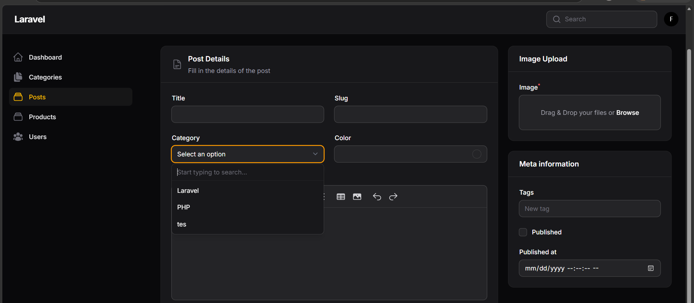
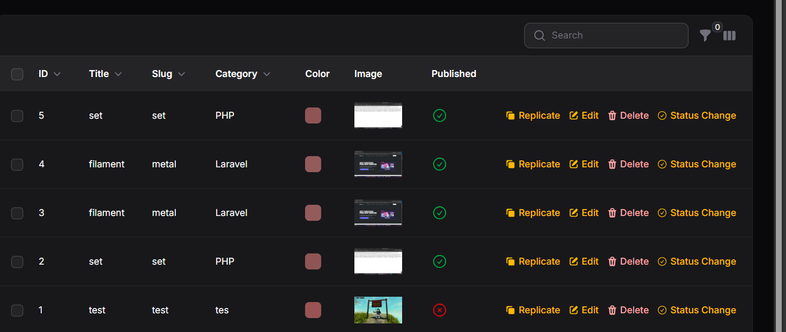
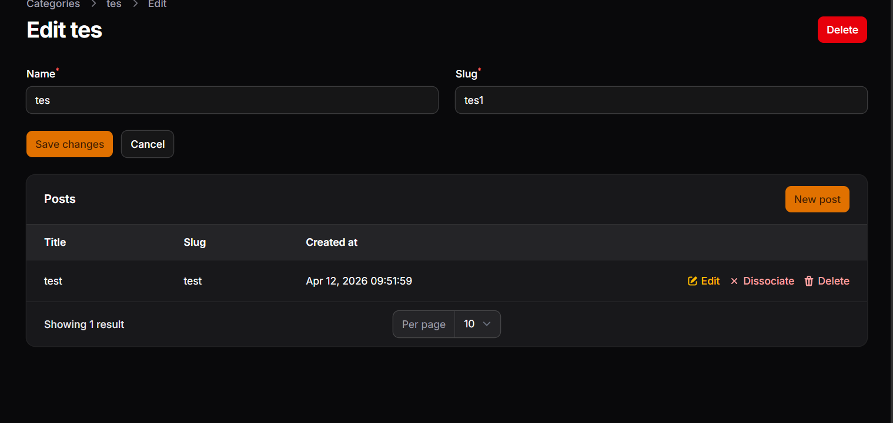

# LAPORAN PRAKTIKUM

## Implementasi Relation pada Filament (HasMany)

### Identitas

* **Mata Kuliah:** Pemrograman Web Lanjut
* **Topik:** Implementasi Relation pada Filament (HasMany)
* **Nama:** Muhammad Fatahillah Athabrani
* **Kelas:** TI2F
* **NIM:** 244107020121

---

## Tujuan

1. Memahami konsep relationship pada Laravel dan Filament.
2. Menggunakan method `relationship()` pada Form Filament.
3. Mengimplementasikan fitur `searchable()` pada dropdown relasi.
4. Menampilkan data relasi pada tabel Filament.
5. Membuat dan menghubungkan Relationship Manager.
6. Mengelola relasi HasMany secara langsung melalui Filament Admin Panel.

---

## Langkah-langkah Praktikum

### 1. Memahami Relasi Category dan Post

Pada praktikum ini saya mempelajari implementasi relasi antara tabel `categories` dan `posts`.

Struktur relasi:

```
Category
   ↓
 HasMany
   ↓
  Post
```

Keterangan:

* Satu Category dapat memiliki banyak Post (`HasMany`).
* Satu Post hanya memiliki satu Category (`BelongsTo`).
---

### 2. Implementasi Relationship pada Form

Untuk menghubungkan Post dengan Category pada Form Filament, saya menggunakan method `relationship()` pada komponen Select.

```php
Select::make('category_id')
    ->relationship('category', 'name')
    ->preload();
```

Penjelasan:

* `category` merupakan nama relasi pada model Post.
* `name` merupakan field yang akan ditampilkan pada dropdown.
* `preload()` digunakan agar data kategori langsung dimuat ketika form dibuka.

---

### 3. Membuat Dropdown Searchable

Jika jumlah kategori semakin banyak, dropdown biasa menjadi kurang efisien. Oleh karena itu saya menambahkan fitur pencarian menggunakan method `searchable()`.

```php
Select::make('category_id')
    ->relationship('category', 'name')
    ->searchable();
```

Keuntungan:

* Data kategori dapat dicari dengan cepat.
* Lebih nyaman digunakan untuk dataset besar.
* Mempermudah proses input data.

--- 

### 4. Membuat Relationship pada Model

Agar Filament dapat mengenali hubungan antar tabel, saya menambahkan relasi pada model.

#### Model Post

```php
public function category()
{
    return $this->belongsTo(Category::class);
}
```

#### Model Category

```php
public function posts()
{
    return $this->hasMany(Post::class);
}
```

Dengan relasi tersebut Laravel dapat mengetahui hubungan antara Post dan Category.

---

### 5. Menampilkan Data Relasi pada Table

Untuk menampilkan nama kategori pada tabel Post, saya menambahkan kolom relasi berikut:

```php
TextColumn::make('category.name')
    ->label('Category');
```

Hasilnya, tabel Post akan menampilkan informasi kategori secara langsung tanpa perlu melihat foreign key `category_id`.

### 6. Membuat Relationship Manager

Filament menyediakan fitur Relationship Manager yang memungkinkan pengelolaan data relasi secara langsung dari resource induk.

Perintah yang digunakan:

```bash
php artisan make:filament-relation-manager
```

Parameter:

* Resource : `CategoryResource`
* Relationship : `posts`
* Title Column : `title`


### 7. Menghubungkan Relationship Manager

Selanjutnya saya menghubungkan Relationship Manager ke Category Resource.

```php
public static function getRelations(): array
{
    return [
        PostsRelationManager::class,
    ];
}
```

Dengan konfigurasi tersebut, setiap Category dapat menampilkan daftar Post yang terkait secara langsung.

---

### 8. Menambahkan Kolom pada Relationship Table

Agar informasi yang ditampilkan lebih lengkap, saya menambahkan beberapa kolom pada tabel relasi.

```php
TextColumn::make('title'),
TextColumn::make('slug'),
TextColumn::make('created_at'),
```

Kolom tambahan ini membantu administrator melihat detail post tanpa membuka halaman lain.

---

### 9. Membuat Form Create Post pada Relationship Manager

Pada Relationship Manager saya menambahkan form pembuatan Post baru.

```php
TextInput::make('title'),

TextInput::make('slug'),
```

Keuntungan utama:

* `category_id` akan terisi otomatis.
* Tidak perlu memilih kategori kembali.
* Mengurangi risiko kesalahan input.

---

## Implementasi Kode

### Post Form

```php
Select::make('category_id')
    ->relationship('category', 'name')
    ->searchable()
    ->preload();
```

### Model Post

```php
public function category()
{
    return $this->belongsTo(Category::class);
}
```

### Model Category

```php
public function posts()
{
    return $this->hasMany(Post::class);
}
```

### Post Table

```php
TextColumn::make('category.name')
    ->label('Category');
```

### Category Resource

```php
public static function getRelations(): array
{
    return [
        PostsRelationManager::class,
    ];
}
```

---

## Hasil (Latihan Praktikum)

### Dropdown Kategori pada Post Form



### Tabel Post dengan Kategori



### Relationship Manager pada Category



### Create Post dari Category


---

## Analisis & Diskusi

### 1. Apa perbedaan `relationship()` dengan `options()`?

* `relationship()` mengambil data langsung dari relasi Eloquent Laravel.
* `options()` mengisi dropdown secara manual menggunakan array atau query tertentu.

Menurut saya, `relationship()` lebih praktis karena otomatis mengikuti relasi yang sudah dibuat pada model.

---

### 2. Mengapa `searchable()` penting untuk dataset besar?

Ketika jumlah data mencapai puluhan atau ratusan bahkan ribuan record, pengguna akan kesulitan mencari item secara manual melalui dropdown biasa. Dengan `searchable()`, pencarian dapat dilakukan secara instan sehingga meningkatkan efisiensi dan pengalaman pengguna.

---

### 3. Apa fungsi Relationship Manager pada Filament?

Relationship Manager digunakan untuk mengelola data relasi secara langsung dari resource induk. Fitur ini memungkinkan proses Create, Read, Update, dan Delete (CRUD) dilakukan tanpa berpindah halaman sehingga pekerjaan administrator menjadi lebih cepat.

---

### 4. Kapan menggunakan HasMany dan BelongsTo?

* **HasMany** digunakan ketika satu data induk memiliki banyak data turunan.

Contoh:

```text
Category → Posts
User → Posts
```

* **BelongsTo** digunakan ketika satu data merupakan bagian dari satu data induk.

Contoh:

```text
Post → Category
Post → User
```

Kedua relasi ini biasanya digunakan secara berpasangan.

---

## Kesimpulan

Pada praktikum ke-14 ini saya berhasil memahami implementasi relationship pada Filament menggunakan relasi HasMany dan BelongsTo. Saya mempelajari penggunaan method `relationship()` pada form, penerapan fitur `searchable()` untuk meningkatkan efisiensi pencarian data, menampilkan data relasi pada tabel, serta mengelola data terkait menggunakan Relationship Manager.

Dengan fitur-fitur tersebut, proses pengelolaan data yang saling berhubungan menjadi lebih mudah, cepat, dan terintegrasi langsung dalam Filament Admin Panel.
