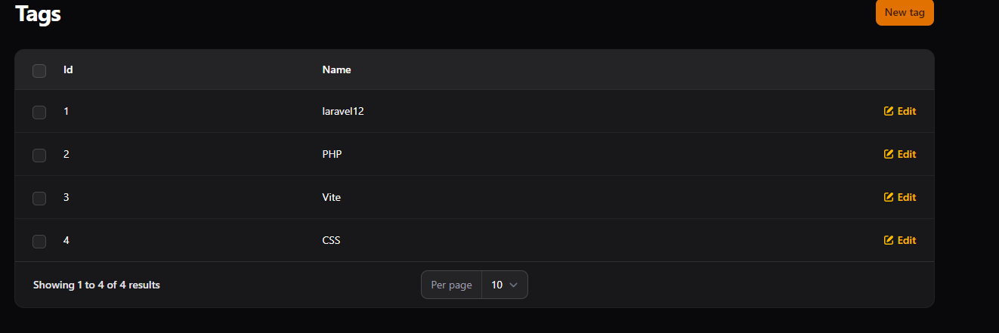
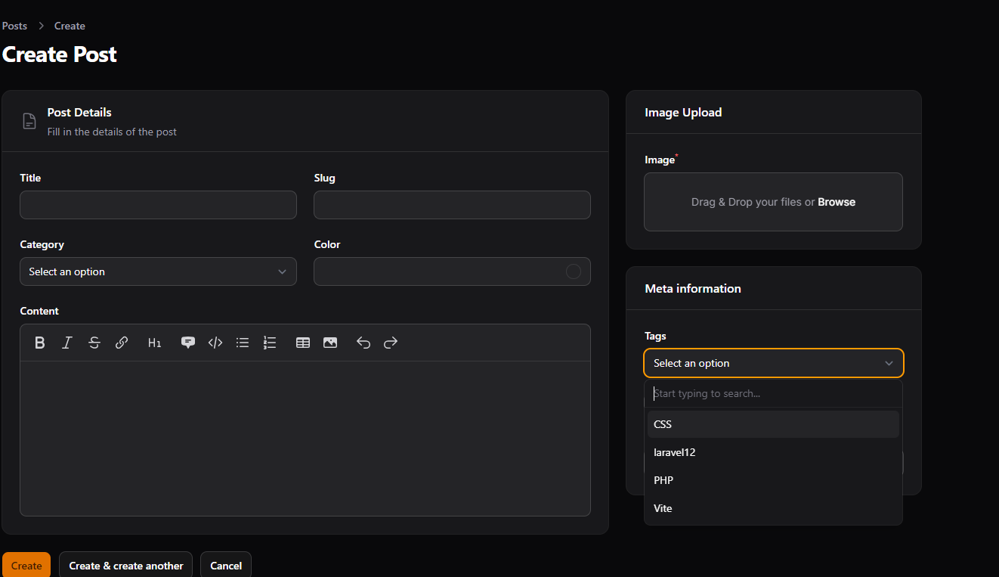
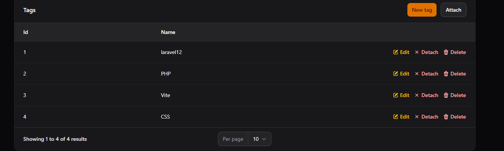
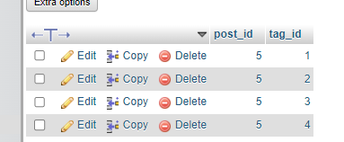

# LAPORAN PRAKTIKUM
## Implementasi Many-to-Many Relationship pada Filament

### Identitas
* **Mata Kuliah:** Pemrograman Web Lanjut
* **Topik:** Implementasi Many-to-Many Relationship pada Filament
* **Nama:** Muhammad Fatahillah Athabrani
* **Kelas:** TI2F
* **NIM:** 244107020121

---

## Tujuan
1. Memahami konsep Many-to-Many Relationship pada database.
2. Membuat tabel relasi (pivot table) pada Laravel.
3. Menghubungkan model menggunakan `belongsToMany`.
4. Menggunakan multiple select relationship pada form Filament.
5. Membuat Tag Resource pada Filament Admin Panel.
6. Mengelola relasi menggunakan Relationship Manager.

---

## Langkah-langkah Praktikum

### 1. Konsep Many-to-Many & Permasalahan JSON Column
Sebelumnya, tag disimpan dalam format JSON di dalam kolom tabel `posts` (contoh: `["Laravel 12", "PHP"]`). Metode ini memiliki banyak kelemahan seperti data sulit dimodifikasi, terjadinya duplikasi data, tidak terstruktur, serta tidak efisien untuk query database. Solusi terbaik adalah menerapkan **Many-to-Many Relationship** di mana satu Post dapat memiliki banyak Tag, dan satu Tag dapat digunakan oleh banyak Post. Relasi ini membutuhkan sebuah tabel perantara yang disebut **pivot table**.

### 2. Rollback Migration & Modifikasi Struktur Database
Sebelum membuat struktur baru, dilakukan rollback migration terlebih dahulu menggunakan perintah `php artisan migrate:rollback` untuk menghapus kolom JSON `tags` pada file migration post yang lama. Setelah bersih, dilakukan pembuatan tiga skema tabel terstruktur di dalam file migration:
* **Tabel `posts`**: Berisi detail artikel (id, title, slug, category_id, dll).
* **Tabel `tags`**: Berisi id dan nama tag.
* **Tabel `post_tag` (Pivot)**: Menghubungkan `post_id` dan `tag_id` dengan constraint `cascadeOnDelete()` dan dipasang sebagai *composite primary key*.

### 3. Pembuatan Resource & Model Tag
Untuk mengelola data master tag, dibuat resource Filament baru melalui perintah `php artisan make:filament-resource Tag`. Pada model `Tag.php`, ditambahkan properti `$fillable = ['name']` agar data nama tag dapat disimpan ke dalam database.

### 4. Menghubungkan Model via BelongsToMany
Agar Laravel mengenali hubungan Many-to-Many ini, kita harus mendefinisikan relasi `belongsToMany` di kedua model:
* Di dalam `Post.php`, dibuat fungsi `tags()` yang mengembalikan `return $this->belongsToMany(Tag::class, 'post_tag');`.
* Di dalam `Tag.php`, dibuat fungsi `posts()` yang mengembalikan `return $this->belongsToMany(Post::class, 'post_tag');`.

### 5. Menggunakan Multiple Select Relationship pada Form Post
Agar admin bisa memilih banyak tag sekaligus saat membuat atau mengedit postingan, komponen input di `PostForm.php` diubah dari `TagsInput` menjadi komponen `Select`. Dengan menambahkan method `->relationship('tags', 'name')` dan `->multiple()`, Filament secara otomatis mengubah input menjadi dropdown interaktif yang terhubung langsung ke tabel tags di database.

### 6. Implementasi Relationship Manager
Untuk mempermudah manajemen, dibuat **Relationship Manager** menggunakan perintah `php artisan make:filament-relation-manager PostResource tags name`. Fitur ini memunculkan tabel pengelolaan tag langsung di bawah form edit Post. Admin bisa menambah, mengedit, menghapus, menempelkan (*attach*), atau melepas (*detach*) tag ke postingan tersebut secara *real-time*.

---

## Hasil (Latihan Praktikum)

* **Halaman Tag Resource (Manajemen Master Data Tag)**

* **Form Post dengan Multiple Tags (Dropdown Relasi Banyak-ke-Banyak)**

* **Relationship Manager Tags (Kelola Tag Langsung dari Halaman Edit Post)**

* **Pivot Table post_tag pada Database (Data Terhubung via ID)**

---

## Analisis & Diskusi

### 1. Apa perbedaan HasMany dan Many-to-Many?
* **HasMany (One-to-Many)** digunakan jika satu baris data induk menguasai banyak data anak, tetapi data anak tersebut hanya bisa terikat pada satu induk saja (misal: Satu Kategori memiliki banyak Post, tapi satu Post hanya punya satu Kategori). Relasi ini hanya butuh foreign key di tabel anak.
* **Many-to-Many** digunakan ketika data di kedua tabel bisa saling memiliki satu sama lain dalam jumlah banyak (misal: Satu Post punya banyak Tag, dan satu Tag nempel di banyak Post). Relasi ini mutlak membutuhkan tabel ketiga (pivot table) sebagai jembatan pembatas hubungan.

### 2. Mengapa pivot table diperlukan?
Pivot table diperlukan untuk menjaga prinsip normalisasi database (RDBMS) dan mencegah terjadinya kekacauan struktur data. Tanpa tabel pivot, kita terpaksa menyimpan banyak ID relasi ke dalam satu kolom tunggal (seperti format JSON atau string yang dipisahkan koma), di mana hal tersebut sangat buruk bagi performa query, menyulitkan proses indexing, serta rawan memicu inkonsistensi data.

### 3. Apa fungsi attach dan detach pada Filament?
* **attach**: Digunakan untuk menyambungkan atau mengaitkan data yang sudah ada di tabel tujuan ke dalam model utama melalui tabel pivot (membuat baris baru di tabel `post_tag`).
* **detach**: Kebalikan dari attach, digunakan untuk memutuskan hubungan relasi data pada tabel pivot tanpa menghapus data asli dari tabel master tag (hanya menghapus baris jembatannya di tabel `post_tag`).

### 4. Mengapa JSON column kurang baik untuk relasi?
Menyimpan data relasi dalam format JSON membuat database kesulitan melakukan operasi pencarian gabungan (seperti JOIN data). Proses filter data, pengubahan (update) satu item spesifik di dalam array JSON, hingga pembuatan statistik relasi akan memakan beban komputasi yang sangat tinggi (tidak efisien) dibandingkan melakukan query standar pada struktur tabel relasi yang sudah ternormalisasi.

---

## Kesimpulan
Melalui praktikum ke-15 ini, saya berhasil mengimplementasikan hubungan relasi Many-to-Many menggunakan framework Laravel dan Filament Admin Panel. Penggunaan komponen Select yang dikombinasikan dengan fungsi `->multiple()` dan `->relationship()` terbukti mempermudah admin dalam mengelola banyak tag sekaligus pada sebuah postingan. Selain itu, penerapan Relationship Manager memberikan pengalaman pengguna (UX) yang sangat efisien, karena manipulasi data pivot (attach dan detach) serta pengelolaan master tag dapat dilakukan secara instan langsung dari halaman edit artikel utama tanpa mengorbankan integritas data di database.
