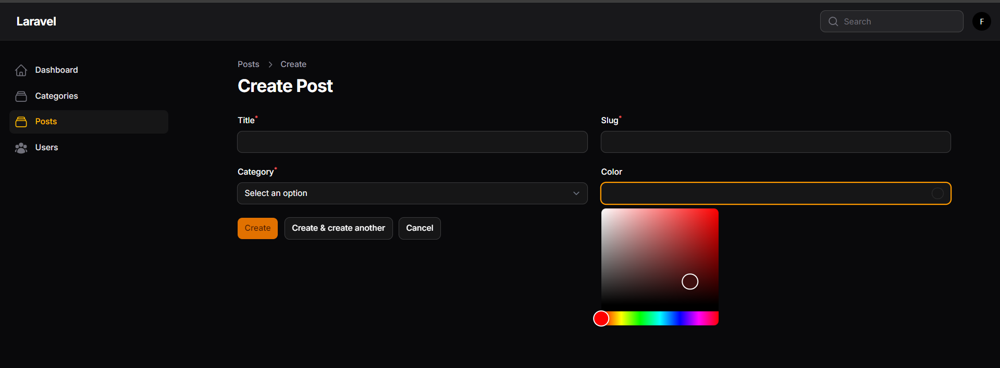
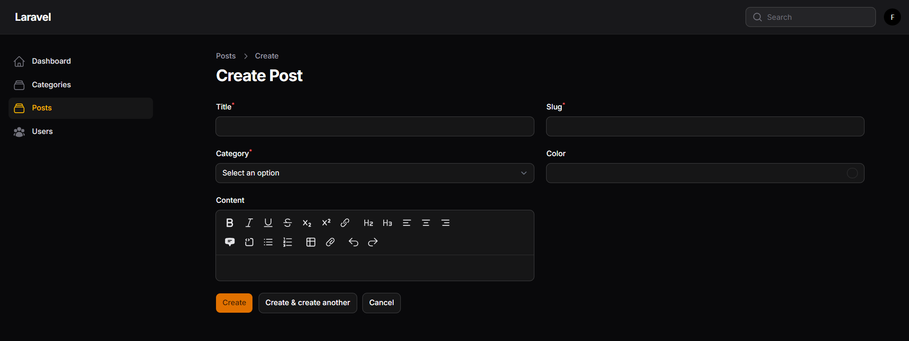
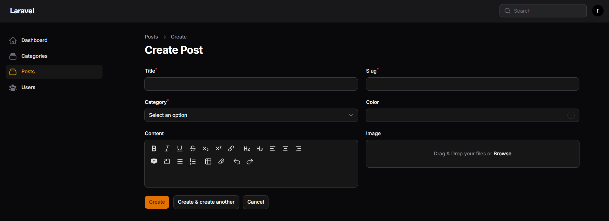
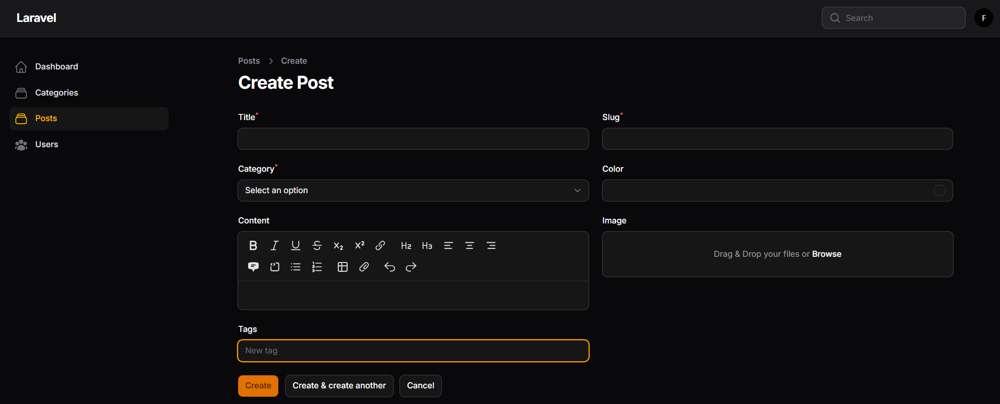
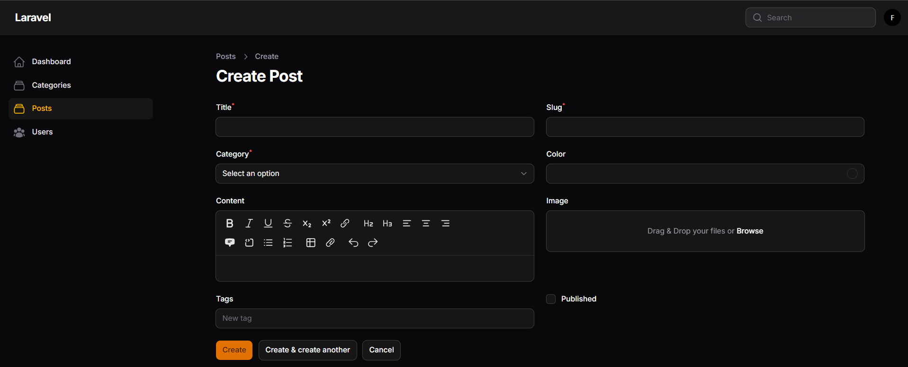
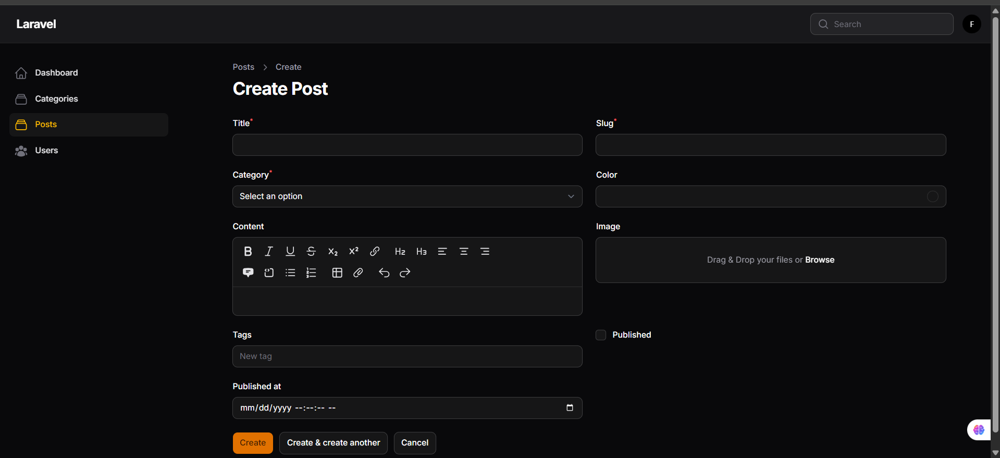

# LAPORAN PRAKTIKUM

## Implementasi Form Elements & Resource Post di Filament

### Identitas

* Mata Kuliah: Pemrograman Web Lanjut
* Topik: Implementasi Form Elements & Resource Post
* Nama: Muhammad Fatahillah Athabrani
* Kelas: TI2F
* NIM: 244107020121

---

## Tujuan

1. Membuat Resource Post pada Filament
2. Menggunakan berbagai Form Elements
3. Menghubungkan Post dengan Category
4. Mengimplementasikan upload file gambar
5. Menampilkan data Post pada tabel
6. Menggunakan fitur tambahan seperti Tags, Checkbox, dan DatePicker

## Langkah-langkah Praktikum

### 1. Membuat Resource Post

```bash
php artisan make:filament-resource Post
```
ini untuk membuat resource post pada filament

---

### 2. Implementasi Form Elements

Tambahkan beberapa komponen pada form:

```php
TextInput::make('title')->required(),
TextInput::make('slug')->required(),
```

```php
Select::make('category_id')
    ->label('Category')
    ->options(\App\Models\Category::all()->pluck('name', 'id'))
    ->required(),
```

```php
ColorPicker::make('color'),
```

```php
MarkdownEditor::make('body'),
```

```php
FileUpload::make('image')
    ->disk('public')
    ->directory('posts'),
```

```php
TagsInput::make('tags'),
```

```php
Checkbox::make('published'),
```

```php
DatePicker::make('published_at'),
```


---

### 3. Implementasi Upload Gambar

```php
FileUpload::make('image')
    ->disk('public')
    ->directory('post'),
```

Jalankan perintah:

```bash
php artisan storage:link
```

## Analisis & Diskusi

1. **Mengapa perlu menjalankan storage:link?**
   Perintah ini digunakan untuk menghubungkan folder storage dengan folder public agar file yang diupload dapat diakses melalui browser.

2. **Apa fungsi $casts pada field JSON?**
   Digunakan untuk mengubah tipe data JSON menjadi array agar lebih mudah digunakan dalam aplikasi Laravel.

3. **Mengapa menggunakan category.name?**
   Agar data yang ditampilkan lebih informatif dibandingkan hanya menampilkan ID category.

4. **Perbedaan MarkdownEditor dan RichEditor**
   MarkdownEditor menggunakan format markdown berbasis teks, sedangkan RichEditor menggunakan tampilan visual seperti editor teks biasa.

---

## Kesimpulan

Pada praktikum ini berhasil dibuat Resource Post dengan berbagai Form Elements menggunakan Filament. Selain itu, berhasil diimplementasikan relasi database, upload file gambar, serta penampilan data pada tabel.

Penggunaan Filament sangat membantu dalam mempercepat proses pengembangan admin panel karena menyediakan berbagai komponen siap pakai.

---
