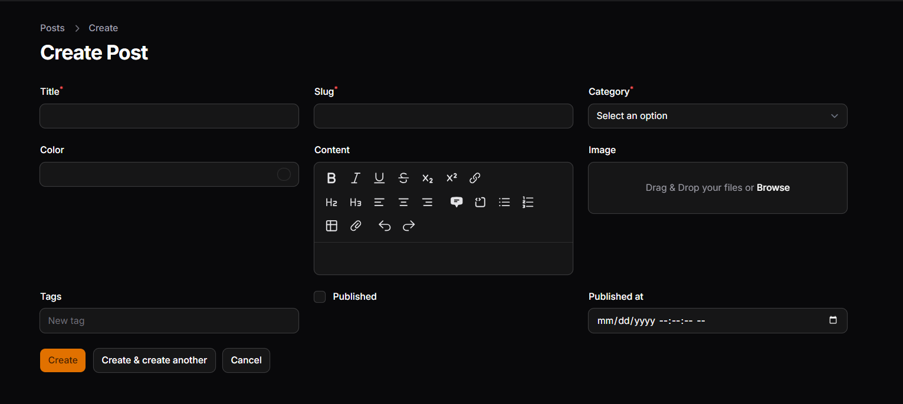
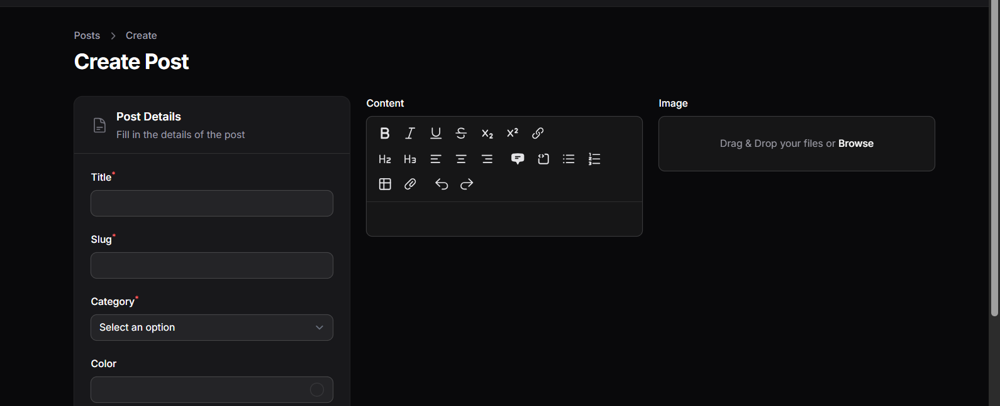
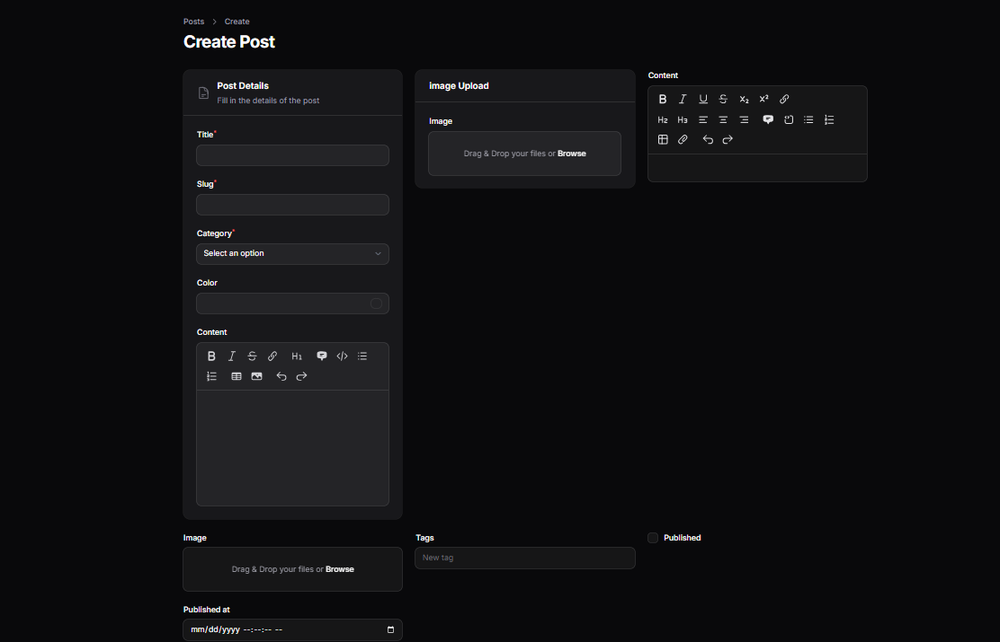
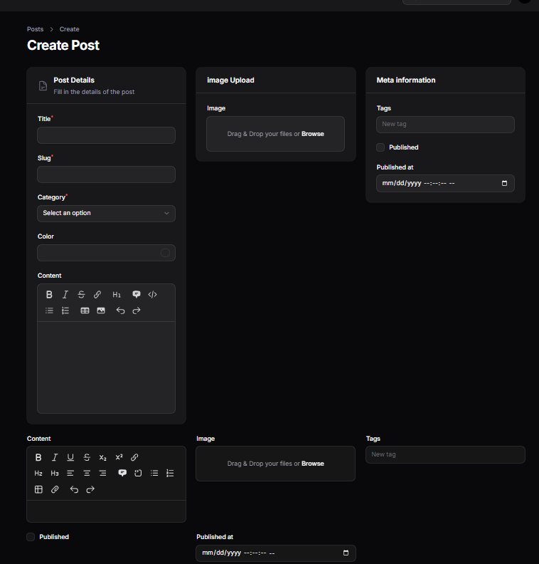
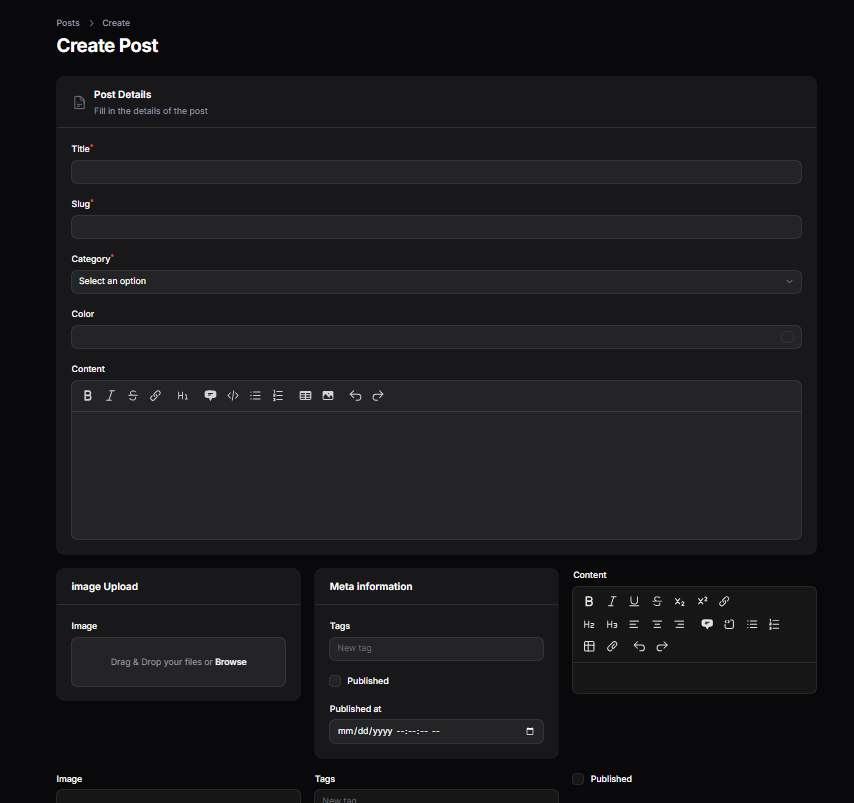
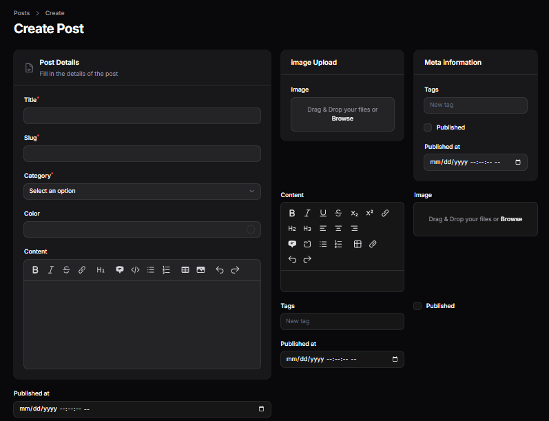
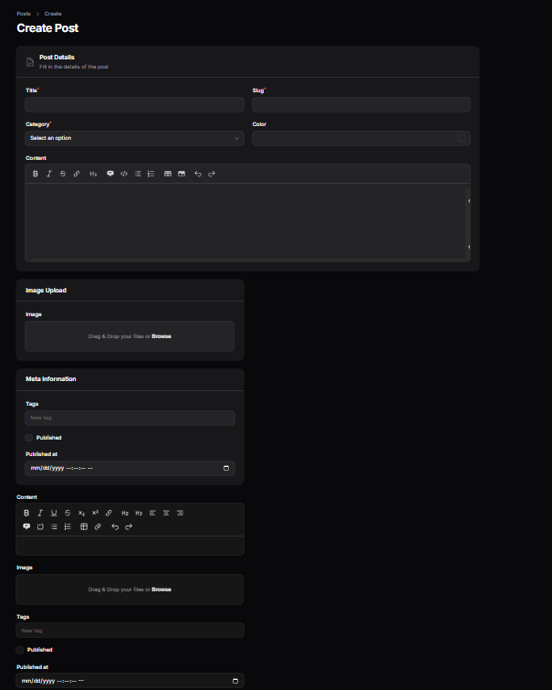

# LAPORAN PRAKTIKUM

## Custom Layout Form dengan Section & Group di Filament

### Identitas

* Mata Kuliah: Pemrograman Web Lanjut
* Topik: Custom Layout Form (Section & Group)
* Nama: Muhammad Fatahillah Athabrani
* Kelas: TI2F
* NIM: 244107020121

---

## Tujuan

1. Mengatur layout form menggunakan `columns()`
2. Menggunakan `Section` untuk mengelompokkan field
3. Menambahkan deskripsi dan icon pada `Section`
4. Menggunakan `Group` untuk pengaturan layout kompleks
5. Mengatur `columnSpan()` untuk proporsi lebar form
6. Mendesain form Post agar lebih profesional

---

## Langkah-langkah Praktikum

### 1. Mengatur Layout Dasar dengan Columns
Mengatur agar form memiliki grid sistem (maksimal 12 kolom). Contoh penggunaan 3 kolom pada schema utama:

```php
->columns(3)
```

### 2. Implementasi Section "Post Details"
Menambahkan informasi mendetail, deskripsi, dan icon pada bagian utama form.

```php
Section::make('Post Details')
    ->description('Fill in the details of the post')
    ->icon('heroicon-o-document-text')
    ->schema([
        // content fields
    ])
```

### 3. Menggunakan Group untuk Layout Kompleks
Membagi form menjadi dua bagian besar:
* **Kiri (2/3 lebar)**: Untuk detail konten utama.
* **Kanan (1/3 lebar)**: Untuk upload gambar dan meta data.

### 4. Mengatur Lebar Field Individual
Gunakan `columnSpan()` untuk mengatur seberapa banyak kolom yang diambil oleh suatu komponen dalam grid.

---

## Implementasi Kode (`PostForm.php`)

```php
public static function configure(Schema $schema): Schema
{
    return $schema
        ->components([
            // Bagian Kiri: Post Details
            Group::make([
                Section::make('Post Details')
                    ->description('Fill in the details of the post')
                    ->icon('heroicon-o-document-text')
                    ->schema([
                        Group::make([
                            TextInput::make('title')->required(),
                            TextInput::make('slug')->required(),
                            Select::make('category_id')
                                ->label('Category')
                                ->options(Category::all()->pluck('name', 'id'))
                                ->required(),
                            ColorPicker::make('color'),
                        ])->columns(2),
                        MarkdownEditor::make('content'),
                    ])
            ])->columnSpan(2),

            // Bagian Kanan: Meta & Image
            Group::make([
                Section::make('Image Upload')
                    ->schema([
                        FileUpload::make('image')
                            ->disk('public')
                            ->directory('posts'),
                    ]),

                Section::make('Meta information')
                    ->schema([
                        TagsInput::make('tags'),
                        Checkbox::make('published'),
                        DateTimePicker::make('published_at'),
                    ]),
            ])->columnSpan(1),
        ])->columns(3);
}
```

---

## Hasil

1. **post details**


2. **post details part 2**


3. **membuat section details**


4. **membuat section meta data**


5. **membuat Column span full**


6. **Menggunakan Group untuk Layout Horizontal**


7. **mengatur lebar field individuals**


## Analisis & Diskusi

1. **Mengapa layout form penting dalam aplikasi admin?**
   Layout yang baik mempermudah admin dalam menginput data, mengurangi kesalahan input, dan membuat alur kerja lebih efisien dengan mengelompokkan data yang relevan.

2. **Apa perbedaan Section dan Group?**
   `Section` adalah pembungkus visual yang memiliki border, judul, dan deskripsi. `Group` adalah pembungkus logika/layout yang tidak terlihat secara visual namun digunakan untuk mengatur distribusi kolom.

3. **Kapan kita menggunakan columnSpanFull()?**
   Saat kita ingin sebuah field (seperti TextArea atau Editor) mengambil seluruh lebar yang tersedia di dalam containernya.

4. **Apa keuntungan sistem grid 12 kolom?**
   Fleksibilitas tinggi dalam pembagian proporsi (misal 1/2, 1/3, 1/4, atau 2/3) yang konsisten dan responsif.

---

## Kesimpulan

Pada praktikum ini, telah berhasil diimplementasikan custom layout pada Filament menggunakan `Section` dan `Group`. Form Post sekarang memiliki tampilan yang lebih profesional dengan pembagian area kerja yang jelas (Main Content vs Sidebar Meta).
