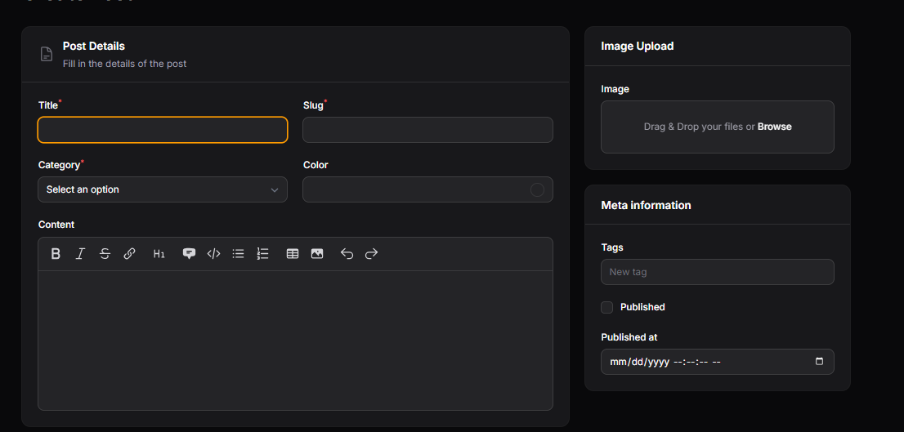
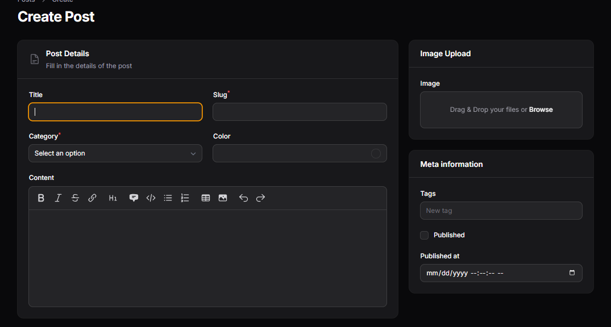
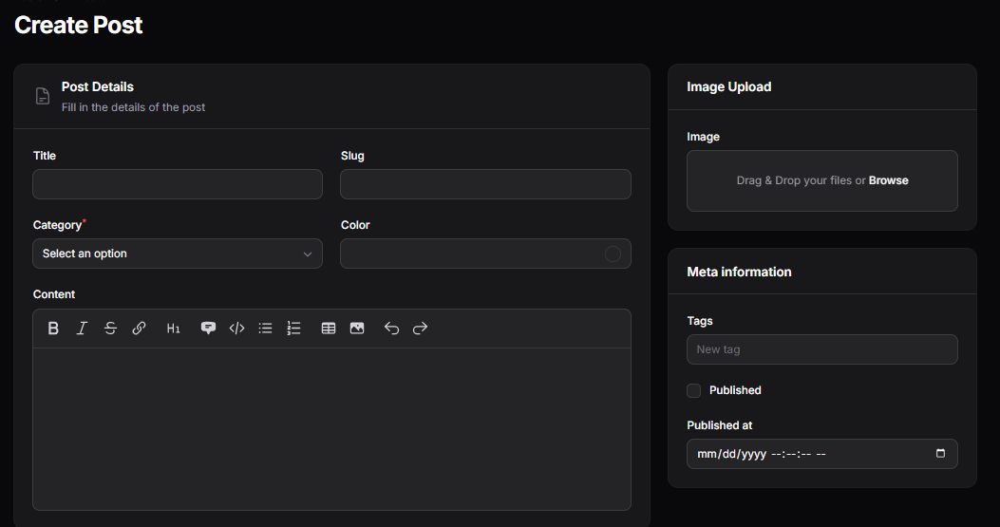
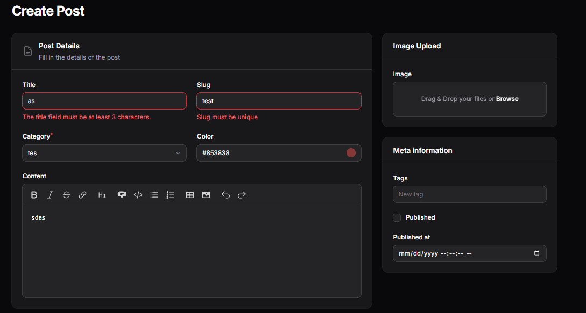
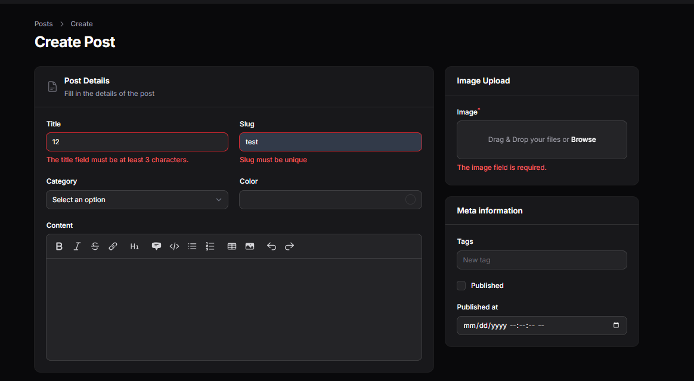

# LAPORAN PRAKTIKUM

## Implementasi Form Validation pada Filament

### Identitas

* Mata Kuliah: Pemrograman Web Lanjut
* Topik: Form Validation di Filament
* Nama: Muhammad Fatahillah Athabrani
* Kelas: TI2F
* NIM: 244107020121

---

## Tujuan

1. Menerapkan validasi form pada Filament menggunakan method native dan rules Laravel.
2. Menggunakan method `required()` untuk kolom wajib diisi.
3. Menggunakan `rule()` dan `rules()` untuk validasi yang lebih kompleks.
4. Menerapkan validasi `unique` untuk mencegah data duplikat.
5. Membuat custom validation message untuk meningkatkan pengalaman pengguna.

---

## Langkah-langkah Praktikum

### 1. Dasar Validasi dengan `required()`
Memberikan tanda bintang merah dan mewajibkan field diisi sebelum data disimpan.

```php
TextInput::make('title')
    ->required()
```

### 2. Validasi dengan `rules()` (Multiple Validation)
Menggunakan aturan validasi Laravel (format string pipe atau array) untuk mengecek panjang minimal dan maksimal karakter.

```php
TextInput::make('title')
    ->rules('required|min:3|max:10')
```

### 3. Implementasi Validasi Unique & Custom Message
Mengatur agar field `slug` tidak boleh sama dengan data yang sudah ada di database dan memberikan pesan error kustom dalam bahasa Indonesia/Inggris.

```php
TextInput::make('slug')
    ->rules('required')
    ->unique()
    ->validationMessages([
        'unique' => 'Slug harus unik dan tidak boleh sama.',
    ])
```

### 4. Validasi pada Komponen Lain
Wajib mengupload gambar dan memilih kategori.

```php
Select::make('category_id')
    ->relationship('category', 'name')
    ->required(),
FileUpload::make('image')
    ->required()
```

---

## Implementasi Kode (`PostForm.php`)

```php
public static function configure(Schema $schema): Schema
{
    return $schema
        ->components([
            Section::make('Post Details')
                ->description('Isi detail postingan Anda')
                ->schema([
                    Group::make([
                        TextInput::make('title')
                            ->rules('required|min:3|max:10'),
                        TextInput::make('slug')
                            ->rules('required')
                            ->unique()
                            ->validationMessages(['unique' => 'Slug must be unique']),
                        Select::make('category_id')
                            ->relationship('category', 'name')
                            ->preload()
                            ->searchable()
                            ->required(),
                        ColorPicker::make('color'),
                    ])->columns(2),
                    MarkdownEditor::make('content'),
                ])->columnSpan(2),

            Group::make([
                Section::make('Image Upload')
                    ->schema([
                        FileUpload::make('image')
                            ->required()
                            ->disk('public')
                            ->directory('posts'),
                    ]),
                // ... meta section
            ])->columnSpan(1),
        ])->columns(3);
}
```

---

## Hasil 

1. **Menggunakan Method required()**


2. **Menggunakan rule()**


3. **Menggunakan rules() (Multiple Validation)**


4. **mengganti pesan error**


5. **final result**

---

## Analisis & Diskusi

1. **Mengapa validasi penting pada admin panel?**
   Validasi menjamin integritas data (data yang masuk sesuai standar) dan mencegah terjadinya error atau crash di sisi database (misal error duplicate entry).

2. **Apa perbedaan validasi client-side dan server-side?**
   Client-side memberikan feedback instan (seperti browser validation), sedangkan server-side dilakukan di PHP untuk memastikan keamanan meskipun form dimanipulasi oleh bot atau serangan luar. Filament sendiri menangani keduanya secara elegan.

3. **Mengapa unique otomatis bekerja saat edit data?**
   Filament cukup pintar untuk mengecualikan (ignore) record yang sedang diedit saat ini dari pengecekan keunikan di database, sehingga tidak terjadi bentrok dengan datanya sendiri.

4. **Kapan kita perlu menggunakan rules array dibanding string?**
   Format array lebih aman digunakan jika sebuah aturan validasi mengandung variabel dinamis atau objek khusus (seperti Rule object di Laravel) yang sulit dituliskan dalam format string pipe.

---

## Kesimpulan

Praktikum ini berhasil mengimplementasikan sistem validasi Laravel ke dalam form Filament. Dengan adanya validasi ini, aplikasi menjadi lebih robust, aman dari data sampah, dan memberikan panduan yang jelas bagi admin saat terjadi kesalahan input.
