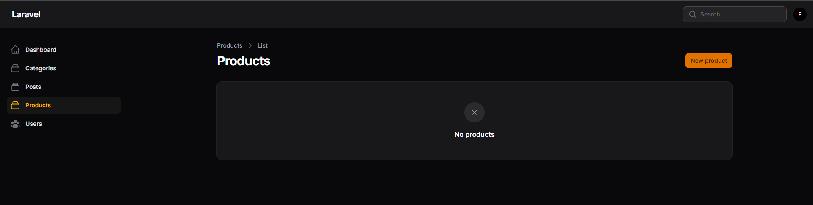
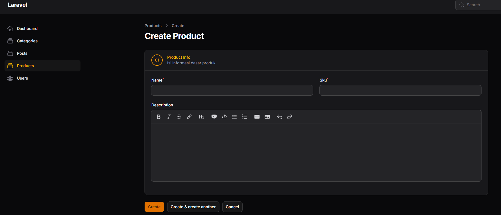
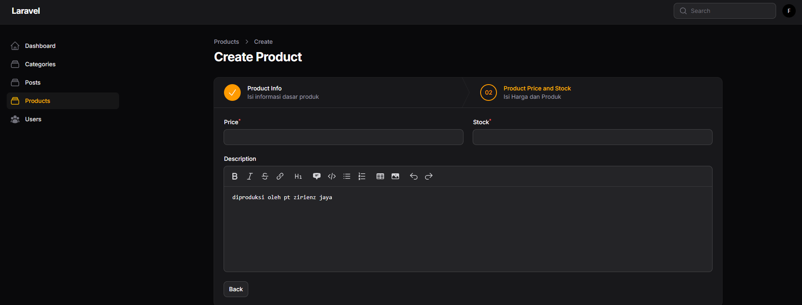
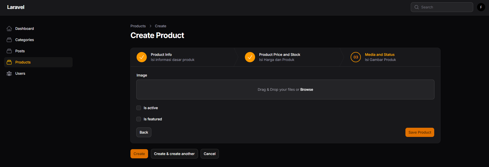
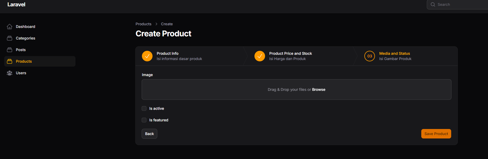
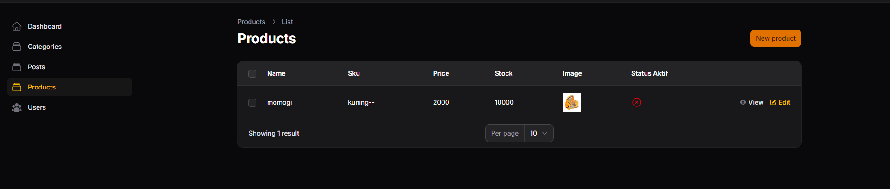

# LAPORAN PRAKTIKUM

## Implementasi Wizard Form (Multi Step Form) di Filament

### Identitas

* Mata Kuliah: Pemrograman Web Lanjut
* Topik: Implementasi Wizard Form (Multi Step Form) di Filament
* Nama: Muhammad Fatahillah Athabrani
* Kelas: TI2F
* NIM: 244107020121

---

## Tujuan

1. Membuat Resource Product.
2. Menggunakan Wizard Form pada Filament.
3. Membagi form menjadi beberapa langkah (step).
4. Menambahkan validasi pada setiap step.
5. Mengatur tombol submit pada Wizard.
6. Menampilkan data Product pada tabel.

---

## Langkah-langkah Praktikum

### 1. Struktur Database Product (Model & Migration)
Membuat file migration dan model untuk `Product`. field yang dibuat meliputi `name`, `sku`, `description`, `price`, `stock`, `image`, `is_active`, dan `is_featured`.

### 2. Membuat Resource Product
Membuat resource Filament untuk produk dengan perintah artisan:
`php artisan make:filament-resource Product`

### 3. Implementasi Wizard Form
Mengonfigurasi method `form` untuk menggunakan `Wizard` component yang dibagi ke dalam 3 step:
- **Step 1: Product Info** (name, sku, description)
- **Step 2: Pricing & Stock** (price, stock)
- **Step 3: Media & Status** (image, is_active, is_featured)

### 4. Menambahkan Validasi & Icon per Step (Tugas Tambahan)
Menambahkan validasi di masing-masing input, contoh pada harga minimal > 0:
```php
TextInput::make('price')->numeric()->required()->minValue(1),
```
Serta menambahkan icon pada setiap step Wizard.

### 5. Mengatur Tombol Submit
Menambahkan custom submit action `save` pada bagian wizard dan menghilangkan default button dengan override method `getFormActions()` di class `CreateProduct.php` dan `EditProduct.php`.

### 6. Menampilkan Data Pada Table & Badge
Mengkonfigurasi kolom pada tabel produk dengan `TextColumn` dan `ImageColumn`. Serta menambahkan badge untuk kolom status `is_active` di tabel.

---

## Implementasi Kode (`ProductResource.php`)

```php
use Filament\Forms\Components\Wizard;
use Filament\Forms\Components\Wizard\Step;
use Filament\Forms\Components\Section;
use Filament\Forms\Components\Group;
use Filament\Forms\Components\TextInput;
use Filament\Forms\Components\MarkdownEditor;
use Filament\Forms\Components\FileUpload;
use Filament\Forms\Components\Checkbox;
use Filament\Forms\Components\Actions\Action;

public static function form(Form $form): Form
{
    return $form->schema([
        Wizard::make([
            Step::make('Product Info')
                ->icon('heroicon-o-information-circle')
                ->description('Isi informasi dasar produk')
                ->schema([
                    Group::make([
                        TextInput::make('name')->required(),
                        TextInput::make('sku')->required(),
                    ])->columns(2),
                    MarkdownEditor::make('description')
                        ->columnSpanFull(),
                ]),
                
            Step::make('Pricing & Stock')
                ->icon('heroicon-o-currency-dollar')
                ->description('Isi harga dan jumlah stok')
                ->schema([
                    TextInput::make('price')
                        ->numeric()
                        ->required()
                        ->minValue(1) // Tugas: validasi minimal harga > 0
                        ->rules(['min:1']),
                    TextInput::make('stock')
                        ->numeric()
                        ->required(),
                ]),
                
            Step::make('Media & Status')
                ->icon('heroicon-o-photo')
                ->description('Upload gambar dan atur status')
                ->schema([
                    FileUpload::make('image')
                        ->disk('public')
                        ->directory('products'),
                    Checkbox::make('is_active'),
                    Checkbox::make('is_featured'),
                ]),
        ])->submitAction(
            Action::make('save')
                ->label('Save Product')
                ->color('primary')
                ->submit('save')
        )->columnSpanFull()
    ]);
}
```

```php
use Filament\Tables\Columns\TextColumn;
use Filament\Tables\Columns\ImageColumn;
use Filament\Tables\Columns\IconColumn;

public static function table(Table $table): Table
{
    return $table->columns([
        TextColumn::make('name')->searchable(),
        TextColumn::make('sku'),
        TextColumn::make('price')->money('IDR', locale: 'id'),
        TextColumn::make('stock'),
        ImageColumn::make('image')->disk('public'),
        IconColumn::make('is_active')
            ->boolean()
            ->label('Status Aktif') // Tugas praktikum (badge/status aktif)
    ]);
}
```

---

## Implementasi Kode (`CreateProduct.php` & `EditProduct.php`)

```php
// Menghilangkan default button
protected function getFormActions(): array
{
    return [];
}
```
## Hasil 

1. **membuat halaman produk**


2. **Membuat isi informasi dari product**


3. **Form isi harga produk**


4. **membuat form media dan status**


5. **tambah tombol submit**


6. **tampilan akhir hasil make product**


---
---

## Analisis & Diskusi

1. **Mengapa Wizard Form lebih baik untuk form panjang?**
   Wizard Form memecah informasi yang kompleks menjadi langkah-langkah yang terorganisir. Ini meminimalisasi beban kognitif (cognitive overload), membuat penyelesaian form terasa lebih cepat, dan mencegah tampilan form yang terkesan intimidasif bagi pengguna.

2. **Kapan kita menggunakan `skippable()`?**
   `skippable()` digunakan pada tahap pendaftaran (step) yang langkahnya berisi field / inputan opsional dan tidak krusial bagi sistem di tahap itu. Sehingga ketika pengguna tidak memiliki data opsional tersebut, mereka bisa melewatkannya dan melengkapi di kemudian hari.

3. **Apa kelebihan multi step dibanding single form panjang?**
   - **Tingkat Konversi Pengisian (Completion Rate) yang lebih baik**: Pengguna cenderung bersedia melanjutkan step ketika sudah melewati satu step pertama, ketimbang melihat sebuah form single yang sangat panjang dari awal ke bawah.
   - **UX yang Lebih Rapi dan Validasi Mudah**: Kesalahan dan error divalidasi per langkah, sehingga panduan perbaikan juga lebih jelas, tidak membuat frustasi seperti error di 10 titik berbeda pada single form sekaligus.

4. **Apakah wizard cocok untuk semua jenis form?**
   Tidak. Untuk form ringkas yang menanyakan jumlah input data sedikit (contoh sign-in, input email newsletter, form kontak simpel), menggunakan wizard malah akan menambah jumlah step click (friction) dan memperlambat pengerjaan. Wizard paling cocok untuk profil berlapis atau checkout e-commerce.

---

## Kesimpulan

Praktikum pada Pertemuan 7 ini berhasil menerapkan konsep Wizard Form (Multi Step Form) sehingga form pengisian produk yang panjang dapat ditampilkan lebih interaktif dengan tahapan (step). Implementasi validasi logika per langkah dan pengaturan custom tombol simpan telah berhasil membantu merancang antarmuka formulir (UI/UX) di tingkat administrator yang lebih ramah pengguna tanpa melonggarkan integritas data.
