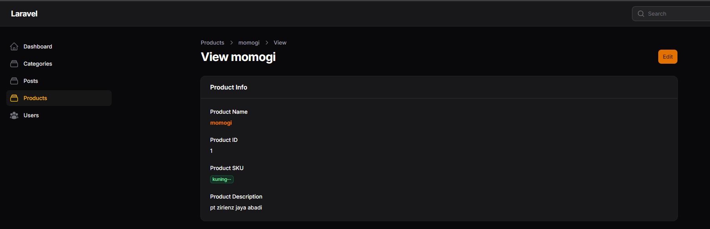
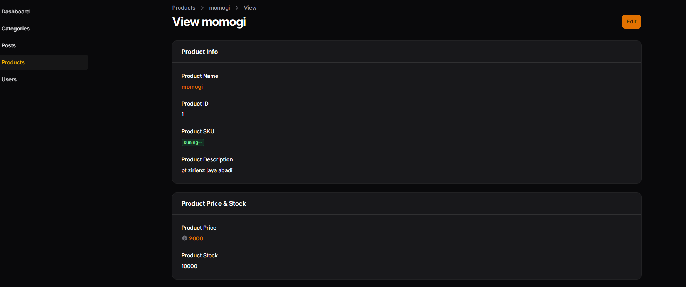
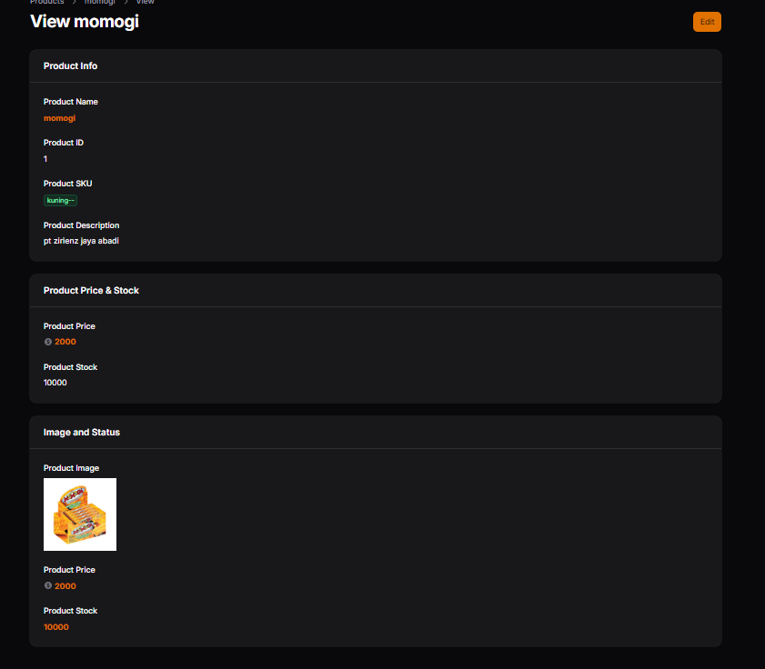
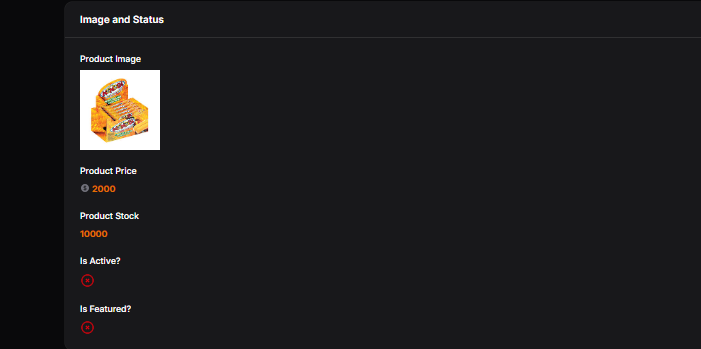
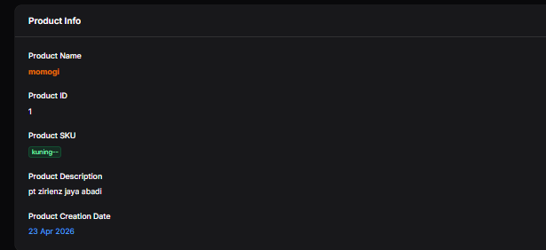

# LAPORAN PRAKTIKUM

## Implementasi Info List (View Page) di Filament

### Identitas

* Mata Kuliah: Pemrograman Web Lanjut
* Topik: Implementasi Info List (View Page) di Filament
* Nama: Muhammad Fatahillah Athabrani
* Kelas: TI2F
* NIM: 244107020121

---

## Tujuan

1. Memahami konsep Info List pada Filament.
2. Mengubah tampilan View Page dari form menjadi display informasi.
3. Menggunakan `TextEntry`, `ImageEntry`, dan `IconEntry`.
4. Menggunakan `Badge`, `Color`, `Icon`, dan `Format Date`.
5. Mendesain halaman detail (show page) yang lebih profesional.

---

## Langkah-langkah Praktikum

### 1. Konsep Info List
Info List digunakan dalam Filament untuk mengubah halaman detail (View) dari yang semula berwujud form input (karena terhubung dengan *form builder*) menjadi pameran data (*display-only* / *read-only*). Ini dilakukan lewat model `ProductInfolist.php` (komponen dari `InfolistBuilder`).

### 2. Mengedit `ProductInfolist.php`
Mengkonfigurasi `ProductInfolist` agar mendefinisikan skema tampilan khusus untuk tampilan detail produk. Pembuatan *Section* memudahkan pemisahan informasi:

- **Section "Product Info"**: Menampilkan Nama produk dengan bobot huruf tebal (bold) dan warna primer, ID, SKU dengan *badge* dan warna hijau (*success*), serta deskripsi.
- **Section "Pricing & Stock"**: Menampilkan harga produk beserta *icon* dolar (atau menggunakan formatter Rupiah pada latihan), serta atribut stok dengan format angka normal.
- **Section "Media & Status" (Image and Status)**: Menampilkan gambar produk disk 'public', ikon status boolean untuk 'Is Active' dan 'Is Featured', beserta tanggal pembuatan `created_at` dengan pewarnaan yang sesuai.

### 3. Modifikasi Tampilan Latihan (Tugas)
Menambahkan format formating harga dengan format Rupiah menggunakan `formatStateUsing()` pada `price`, memberikan icon pada tampilan stock, dan memberikan pewarnaan yang berbeda pada badge SKU.

---

## Implementasi Kode (`ProductInfolist.php`)

```php
use Filament\Infolists\Components\Section;
use Filament\Infolists\Components\TextEntry;
use Filament\Infolists\Components\ImageEntry;
use Filament\Infolists\Components\IconEntry;
use Filament\Schemas\Schema;

public static function configure(Schema $schema): Schema
{
    return $schema
        ->components([
            Section::make('Product Info')
                ->schema([
                    TextEntry::make('name')
                        ->label('Product Name')
                        ->weight('bold')
                        ->color('primary'),
                    TextEntry::make('id')
                        ->label('Product ID'),
                    TextEntry::make('sku')
                        ->label('Product SKU')
                        ->badge()
                        ->color('success'), // Latihan: pewarnaan badge yang berbeda
                    TextEntry::make('description')
                        ->label('Product Description'),
                ])
                ->columnSpanFull(),

            Section::make('Pricing & Stock')
                ->schema([
                    TextEntry::make('price')
                        ->label('Product Price')
                        ->icon('heroicon-o-currency-dollar')
                        ->formatStateUsing(fn ($state) => 'Rp ' . number_format($state, 0, ',', '.')), // Latihan format Rupiah
                    TextEntry::make('stock')
                        ->label('Product Stock')
                        ->icon('heroicon-o-archive-box'), // Latihan: menambahkan icon stock
                ]),

            Section::make('Media & Status')
                ->schema([
                    ImageEntry::make('image')
                        ->label('Product Image')
                        ->disk('public'),
                    IconEntry::make('is_active')
                        ->label('Is Active')
                        ->boolean(),
                    IconEntry::make('is_featured')
                        ->label('Is Featured')
                        ->boolean(),
                    TextEntry::make('created_at')
                        ->label('Product Creation Date')
                        ->date('d M Y')
                        ->color('info'),
                ]),
        ]);
}
```

---

## Hasil (Latihan Praktikum)

1. **Section Product Info**


2. **Section Pricing & Stock** (Terdapat format Rupiah dan ikon stock)


3. **Section Media & Status**


4. **Menampilkan status boolean**


5. **Menampilkan tanggal dengan format**

---

## Analisis & Diskusi

1. **Mengapa View Page tidak cocok menggunakan form input?**
   Halaman tampilan (View Page) pada prinsipnya digunakan untuk mengkonsumsi atau membaca informasi (`read-only`), bukan untuk mengubahnya. Menggunakan form input yang bersifat mendistraksi (karena kotak input memberi sugesti "bisa diedit" atau memberikan ilusi interaktif) menjadi tidak intuitif, kurang struktural apabila isi datanya panjang, dan secara desain UI/UX merusak kesan layar *display detail data* yang profesional.

2. **Apa perbedaan TextColumn dan TextEntry?**
   - `TextColumn`: Merupakan bagian dari komponen **Table Builder** pada Filament. Digunakan untuk merender konten berbentuk teks di dalam setiap sel kolom tabel pada halaman awal (Index list data). 
   - `TextEntry`: Merupakan bagian dari komponen **Infolist Builder** pada Filament. Berfungsi untuk merender nilai teks sebagai bacaan statis pada halaman *View Detail*, dengan properti penataan susun (misalnya dibungkus dengan *Section*) yang lebih fleksibel terlepas dari format sel tabel.

3. **Kapan kita menggunakan badge?**
   `badge()` cocok digunakan apabila kita ingin menyoroti atau membedakan secara visual suatu atribut status, kategori, kata kunci, atau *identifier* unik (seperti kode identitas SKU produk, status pengiriman "Berhasil"/"Pending"). *Badge* memberikan struktur yang rapi (mirip tag konseptual) agar informasi krusial terbaca lebih jelas sekilas oleh mata saat memindai konten panjang.

4. **Apa keuntungan menggunakan IconEntry untuk boolean?**
   Menggunakan bentuk `IconEntry` akan mengkonversi nilai abstrak '1' (True) atau '0' (False) / Ya atau Tidak menjadi grafis visual yang universal seperti centang (✔️) untuk aktif atau silang (❌) untuk tidak. Secara komprehensif, otak manusia memproses bentuk gambar/ikon berkali-kali lebih cepat dibandingkan membaca teks, yang meningkatkan efisiensi pembacaan data administrasi secara masif.

---

## Kesimpulan

Pada praktikum Pertemuan 8, mahasiswa sukses mentransisikan halaman View produk bawaan Filament yang awalnya berupa interaksi formulir (form builder) menjadi tampilan representasi murni informasi statis (`display-only`) lewat fitur Info List. Lewat bantuan instrumen visualisasi sepeti `TextEntry`, `ImageEntry`, maupun `IconEntry`, halaman yang terbentuk terlihat *clean*, elegan, dan lebih profesional. Selain itu modifikasi atribut tambahan seperti format Rupiah, warna lencana (badge), dan ikon tambahan kian memperkaya antarmuka pengalaman pengguna (UX) untuk tingkatan admin.
