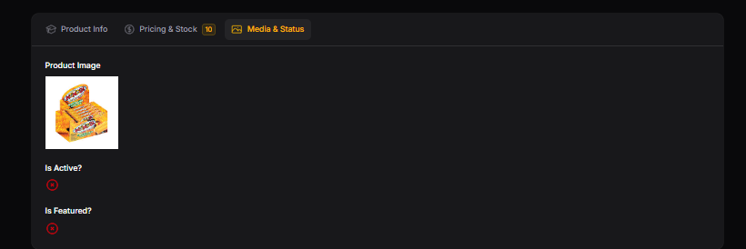
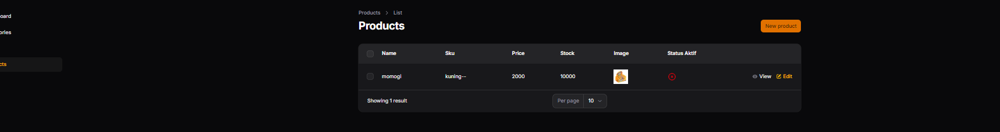
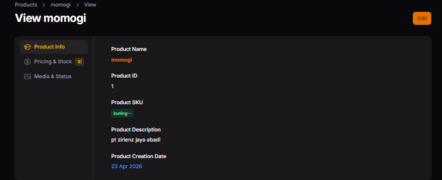
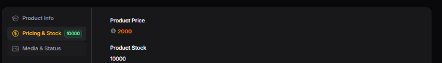

# LAPORAN PRAKTIKUM

## Implementasi Tabs pada Info List di Filament

### Identitas

* Mata Kuliah: Pemrograman Web Lanjut
* Topik: Implementasi Tabs pada Info List di Filament
* Nama: Muhammad Fatahillah Athabrani
* Kelas: TI2F
* NIM: 244107020121

---

## Tujuan

1. Menggunakan komponen `Tabs` pada Info List.
2. Mengelompokkan informasi detail ke dalam beberapa tab.
3. Menambahkan icon dan badge pada tab.
4. Mengubah orientasi tab (horizontal & vertical).
5. Mendesain halaman View agar lebih ringkas dan *user-friendly*.

---

## Langkah-langkah Praktikum

### 1. Konsep Tabs di Info List
Apabila data yang ditampilkan pada Detail Info List sangat banyak (contoh apabila ada lebih dari 5 *Section* independen), pengguna harus melakukan *scroll* layar panjang ke bawah. `Tabs` dapat secara instan merangkum rentetan section yang panjang tersebut menjadi berlapis-lapis di dalam satu bingkai ringkas.

### 2. Mengubah Section Menjadi Tabs
Melakukan modifikasi terhadap skema `ProductInfolist.php` milik fungsi View komponen, mengelompokkan *schema* sebelumnya untuk difungsikan menggunakan pola `<Tabs><Tab></Tab></Tabs>`.

### 3. Implementasi Skema
Terdapat 3 Tab utama yang dibentuk untuk menggantikan 3 *Section* pada pertemuan sebelumnya:
- **Tab 1: Product Info**. Ditambahkan *icon* `heroicon-o-academic-cap`. Memuat Nama Produk, SKU, Description, dan Tanggal Buat Produk.
- **Tab 2: Pricing & Stock**. Menambahkan *icon* dolar, angka pada badge (dinamis menggunakan angka/variabel jika memungkinkan), serta menampilkan format nilai uang dan jumlah *stock*. 
- **Tab 3: Media & Status**. Menambahkan icon photo. Menampilkan Image publik, *icon check* & silang untuk *Is Active* dan *Is Featured*.

### 4. Implementasi Fitur Tambahan (Tugas)
Menambahkan pengaturan formasi khusus seperti `badgeColor()` untuk warna lencana, dan memberikan method `->vertical()` pada `Tabs::make('Product Tabs')` untuk mengubah rentetan judul tab dari sisi atas (horizontal menyamping) pindah menjadi dideret ke sisi samping (vertikal ke bawah).

---

## Implementasi Kode (`ProductInfolist.php`)

```php
use Filament\Infolists\Components\TextEntry;
use Filament\Infolists\Components\ImageEntry;
use Filament\Infolists\Components\IconEntry;
use Filament\Schemas\Components\Tabs;
use Filament\Schemas\Components\Tabs\Tab;
use Filament\Schemas\Schema;

public static function configure(Schema $schema): Schema
{
    return $schema
        ->components([
            Tabs::make('Product Tabs')
                ->vertical() // Tugas: Ubah tampilan menjadi vertical
                ->tabs([
                    Tab::make('Product Info')
                        ->icon('heroicon-o-academic-cap') // Latihan: Custom Icon
                        ->schema([
                            TextEntry::make('name')
                                ->label('Product Name')
                                ->weight('bold')
                                ->color('primary'),
                            TextEntry::make('sku')
                                ->label('Product SKU')
                                ->badge()
                                ->color('success'),
                            TextEntry::make('description')
                                ->label('Product Description'),
                            TextEntry::make('created_at')
                                ->label('Product Creation Date')
                                ->date('d M Y')
                                ->color('info'),
                        ]),
                    
                    Tab::make('Pricing & Stock')
                        ->icon('heroicon-o-currency-dollar') // Latihan: Custom Icon
                        ->badge('10') // Latihan: Badge (Bisa disesuaikan statis/dinamis tergantung data instans)
                        ->badgeColor('warning') // Latihan: Tambahkan warna badge berbeda
                        ->schema([
                            TextEntry::make('price')
                                ->label('Price')
                                ->icon('heroicon-o-currency-dollar'),
                            TextEntry::make('stock')
                                ->label('Stock'),
                        ]),

                    Tab::make('Media & Status')
                        ->icon('heroicon-o-photo') // Latihan: Custom Icon
                        ->schema([
                            ImageEntry::make('image')
                                ->label('Product Image')
                                ->disk('public'),
                            IconEntry::make('is_active')
                                ->label('Active')
                                ->boolean(),
                            IconEntry::make('is_featured')
                                ->label('Featured')
                                ->boolean(),
                        ]),
                ])->columnSpanFull(),
        ]);
}
```

---

## Hasil (Latihan Praktikum)
**penambahan fitur tab**

1. **Tabs Horizontal (Sebelum modifikasi `vertical()`)**


2. **Tabs Vertical (Sesudah modifikasi `vertical()`)**


3. **Tab Dengan Badge (Icon & Badge Pada Profil/Pricing Tab)**


---

## Analisis & Diskusi

1. **Kapan kita menggunakan Tabs dibanding Section?**
   Kita menggunakan `Tabs` ketika layar memuat banyak kelompok informasi (grup variabel/atribut) mandiri (tidak selalu perlu dibaca konsekutif/secara bersamaan berturut-turut). Apabila data detail panjang dikumpulkan lewat `Section` biasa, pengguna akan capek *scroll* jauh ke bawah dan layar terkesan berantakan.

2. **Apa kelebihan Tabs untuk data panjang?**
   - **Efisiensi Ruang (*Space-saving*)**: Mengompres blok tinggi vertikal menjadi sekecil porsi layar saja, membiarkan mata manusia lebih tertuju pada layar yang sedang aktif. 
   - **Organisasi (*Categorization*)**: Memotong informasi menjadi per departemen yang logis, misanya memisahkan "Data Produk", "Gambar Galeri", dan "Log Modifikasi Audit", tanpa tumpang tindih.

3. **Apakah Tabs bisa digunakan pada Form juga?**
   Tentu saja. `Tabs` di Filament secara *native* dapat digunakan baik pada `InfolistBuilder` (komponen `\Filament\Infolists\Components\Tabs`) maupun pada `FormBuilder` (komponen `\Filament\Forms\Components\Tabs`). Pada konteks Form, *tabs* efektif untuk *wizard* semi-panjang sebagai alternatif form per langkah (Wizard Steps).

4. **Bagaimana jika tab terlalu banyak?**
   Jika jumlah *Tab* terlalu banyak (misal lebih dari 7 kategori tab), tampilan *horizontal tabs* dapat melebihi lebar layar alias "terpotong" (me-memicu *scroll bar* horizontal), yang bisa menyebabkan pengalaman UI membingungkan (disorientasi ruang bagi pengguna). Cara mengatasinya adalah dengan merangkum kategori dan mengkombinasikan tipe UI formasi struktur menggunakan mode `->vertical()`, sehingga jejeran label akan lebih leluasa tumbuh ke ruang ekstra vertikal pada sisi kiri halaman.

---

## Kesimpulan

Pada praktikum kali ini, mahasiswa berhasil memperbaiki model sistem pengarsipan/struktur representasi halaman `View` produk dengan mengintegrasikan antarmuka (`UI`) **Tabs**. Modifikasi dari susunan konvensional berseri `Section` menjadi kategori bertumpuk `Tabs` (dalam format horizontal maupun vertikal) berhasil meningkatkan fungsi navigasi layar pengguna dan mengurangi distraksi gulir *scrollbar* secara drastis saat mengamati suatu informasi obyek produk dalam Database. Hal ini menyajikan presentasi web *Dashboard* yang efisien, ramping, dan profesional.
